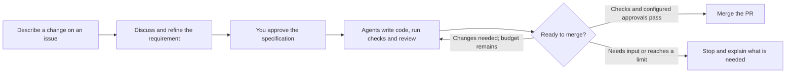

# NexKit

**Turn a requirement into a reviewed, tested code change.**

NexKit coordinates coding workflows from your project's requirements, settings
and approvals. You describe a change, discuss the requirement and approve it
when it is ready. The configured pipeline writes code, runs checks, reviews the
result and merges when the required conditions pass.

NexKit includes a Codex plugin distributed through this repository's marketplace,
a CLI for project setup, and reusable GitHub Actions workflows.

You choose the pipelines, models, usage limits and approval steps during setup.
Each project has its own configuration, runner and model access.

Get [NexKit 1.2.2](https://github.com/phuongnse/nexkit/releases/tag/v1.2.2).
See the [verification guide](docs/acceptance.md) for checks and how to read their results.

**New to NexKit? Start with the [setup roadmap](docs/setup-roadmap.md).**
It explains what you need, where each part runs and how to know setup is finished.

## What do you need first?

For the current GitHub integration, start with **one GitHub repository**.
Choose how its pipeline will access a model:

- **API access on GitHub-hosted runners:** you provide an API key; no VPS is needed.
- **Codex subscription on your own runner:** use Docker Engine on Ubuntu,
  or Ubuntu under WSL 2 on Windows, and sign in to the project container.
  Ubuntu 24.04 is the CI reference environment.
  Docker Desktop is optional. A VPS is one option. Read the
  [experimental integration's support boundary](docs/self-hosted.md#support-boundary).

Both host choices run the same Linux container. For Windows prerequisites and
runner lifetime, see [Windows host setup](docs/windows-runner.md).

You can plan the configuration before provisioning a runner. Each project uses
its own settings and account access; installing the plugin grants no access to
the author's infrastructure.

Then choose how to set up the project:

| How you want to work | Follow this guide |
|---|---|
| Let Codex prepare the files for review | [Install the plugin and use the setup skill](docs/getting-started.md) |
| Edit files and run commands yourself | [Manual setup with a complete editable example](docs/manual-setup.md) |
| Understand the prerequisites and order first | [Setup roadmap](docs/setup-roadmap.md) and [common questions](docs/setup-faq.md) |

Both paths install project configuration and GitHub workflows. You then configure
GitHub permissions and model access, check readiness, and verify a small request.
For daily work, collaborators can use GitHub issues and PRs without installing
the plugin or opening a local assistant.

## How it works

This is one example of a delivery workflow. Setup can add, remove or rearrange
stages to fit your project. Automatic merging requires passing checks and a
separate AI review.



You can close your local chat after submitting a request. Work continues through
GitHub Actions and the configured runner. Publishing a release has its own
request and approval.

## Set up with Codex

You need Python 3.11+, Git, GitHub CLI (`gh`), and Codex CLI with plugin support.
For setup, you also need access to manage the target repository's Actions and
branch rules. See [the full installation guide](docs/getting-started.md) for
prerequisites and runner choices.

Run these commands in a directory where you keep tools:

Use the release tag when installing the toolkit. Project setup records its full
commit SHA in the configuration and workflows.

```sh
git clone --branch v1.2.2 https://github.com/phuongnse/nexkit.git
cd nexkit
export PATH="$PWD/bin:$PATH"
codex plugin marketplace add "$PWD"
codex plugin add nexkit@nexkit
nexkit --version
```

The `PATH` setting applies to this terminal. The full guide explains how to keep
the command available in new terminals.

On Windows, use PowerShell and the bundled `nexkit.cmd` launcher:

```powershell
git clone --branch v1.2.2 https://github.com/phuongnse/nexkit.git
Set-Location nexkit
$nexkitSource = (Get-Location).Path
$env:Path = "$nexkitSource\bin;$env:Path"
codex plugin marketplace add $nexkitSource
codex plugin add nexkit@nexkit
nexkit --version
```

Next, open **your application repository** in a new Codex session:

```sh
cd /path/to/your-project
codex
```

In PowerShell, use `Set-Location C:\path\to\your-project`, then `codex`.

Type `$`, select **`nexkit:nexkit-init`**, and describe what you want. For example:

> Set up NexKit for this repository. Read the existing code and test commands.
> Help me choose the pipelines, model access, usage limits and approval steps.
> Enable starting requests from issue comments for the pipelines we select.
> Show me the configuration and workflow changes before applying them.

The setup skill prepares the project's files and GitHub settings for your
review. Setup is complete when the accepted workflows are on the default branch
and their configuration, checks and model access have been verified.

## Start a change

After setup has enabled issue intake, create an issue in your project and
describe the change. If your pipeline is named `maintenance`, post this comment:

```text
/nexkit start maintenance
```

Use the pipeline name chosen for **your** project. The bot keeps the same issue,
asks any needed questions, and updates the specification. Reply with ordinary
comments while discussing the requirement.

When it is ready, copy the exact approval command from the bot:

```text
/nexkit approve <hash-from-the-bot>
```

The hash identifies that version of the requirement. It is different from the
issue number. The pipeline starts delivery after a valid approval. If you enabled
PR approval or another stage approval, the bot will explain that later action too.

You can also submit a request through the `nexkit-request` skill or the CLI.
See [daily use](docs/daily-use.md) for the complete walkthrough.

## What can you configure?

| Your choice | Examples |
|---|---|
| Pipelines and stages | Separate delivery and audit pipelines; an extra planning stage |
| Agent settings | Model, reasoning effort, task instructions and time limit for each call |
| CLI release | Optional installation pin; runtime checks required capabilities |
| Usage limits | Delivery rounds, model calls, execution time and clarification limits |
| Reviews and approvals | PR approval, approval after planning, reviewer count and waiting time |
| Checks | Your real test, build, lint and end-to-end commands |
| Runner and login | GitHub-hosted jobs with API authentication, or your own configured runner |
| Releases | Whether to enable them, what to build and which files to publish |

Use the setup skill again to change these choices. It prepares a reviewable
update to the project configuration and workflows.
[See examples and where each setting lives.](docs/project-setup.md)

For an installed project, select a published NexKit release from its repository:

```sh
nexkit use --version 1.2.2 --dry-run
nexkit use --version 1.2.2
```

The same command can select a lower version, such as `1.0.0`. It verifies the
release and current configuration before updating workflow pins, accepted hashes
and project skills. Commit the changes through your normal PR checks.
See [release selection](docs/versions.md#select-a-project-release) for prerequisites
and the supported workflow bindings.

### Extend a pipeline

Skills guide the agents; reusable jobs run the work; your GitHub workflow connects
the jobs. A project can add its own agent instructions, commands or GitHub Actions.

NexKit 1.2.2 also supports standalone task pipelines and recorded project steps
with approval and completion. Read [Build a pipeline from steps](docs/project-steps.md)
for the configuration, examples and current verification limits.

## Current support

**NexKit 1.2.2** supports **GitHub and Codex**.
GitHub provides repositories,
issues, PRs and Actions; the official Codex CLI runs the agents. Codex plugin
installation and container tools support Linux and Windows/WSL.
See the [support guide](docs/support.md) for the supported paths and prerequisites.

The optional ChatGPT subscription runner requires your own infrastructure and
login. NexKit's public-repository subscription integration is experimental; read
the [runner guide and support boundary](docs/self-hosted.md) before choosing it.

The [verification guide](docs/acceptance.md) explains the checks and how to
distinguish live integration evidence from tests that simulate services or model
responses. Results belong to the corresponding run or release.

The plugin, CLI and runner image use version `1.2.2`. Project configuration
and release candidate data use `schema: 1`. See [versions](docs/versions.md)
for what each number means.

## Documentation

- [Start from scratch: prerequisites, choices and setup order](docs/setup-roadmap.md)
- [Set up with Codex](docs/getting-started.md)
- [Set up manually](docs/manual-setup.md)
- [Common setup questions](docs/setup-faq.md)
- [Configure your project](docs/project-setup.md)
- [Daily use: issues, approvals, status and releases](docs/daily-use.md)
- [How the pieces work together](docs/architecture.md)
- [Troubleshooting and recovery](docs/operations.md)
- [All guides and technical references](docs/README.md)
