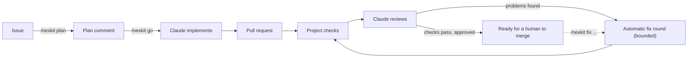

# NexKit

**Turn GitHub issues into reviewed, tested pull requests with Claude Code.**

NexKit is a GitHub Actions pipeline plus a Claude Code plugin. A collaborator asks for a
plan on an issue, approves it, and NexKit implements the change on a branch, runs the
project's checks, has a separate Claude session review the result and opens a pull
request. A person decides whether to merge.



## Supported versions

Everything the pipeline installs is pinned to the version NexKit was tested with, so a
release never changes underneath you. New Claude Code versions still arrive quickly: a
weekly job proposes the newest stable Claude Code, CI tests it with real Claude, and a new
NexKit release ships it.

| Dependency | Supported | Tested |
|---|---|---|
| Platform | GitHub and GitHub Actions | |
| Runner | GitHub-hosted `ubuntu-24.04` | `ubuntu-24.04` |
| Claude Code | the version pinned in [`nexkit/__init__.py`](nexkit/__init__.py), installed by the pipeline | that version, with a live smoke test |
| Python for NexKit in the pipeline | 3.12, installed without changing your project's Python | 3.12 |
| Python for the `nexkit` CLI on your machine | 3.12 or newer | 3.12 |

Your project's own commands (`setup`, `checks`) use whatever tools they install on
`ubuntu-24.04`.

## What you need

- A GitHub repository with a test or lint command that can run on `ubuntu-24.04`.
- A Claude credential stored as a repository secret: a Claude Pro or Max subscription
  token from `claude setup-token` (`CLAUDE_CODE_OAUTH_TOKEN`), or an Anthropic API key
  (`ANTHROPIC_API_KEY`).
- No server or self-hosted runner. Everything runs on GitHub-hosted runners, which are
  free for public repositories.

## Set up a repository

### With Claude Code

Install the plugin once:

```text
/plugin marketplace add phuongnse/nexkit
/plugin install nexkit@nexkit
```

Then open Claude Code in your repository and run `/nexkit:setup`. It finds your test
commands, writes the two NexKit files, helps you add the secret and runs `nexkit doctor`.

### By hand

```sh
pipx install git+https://github.com/phuongnse/nexkit@v1.2.0   # or run bin/nexkit from a clone
cd your-repository
nexkit init --check "test=npm test" --check "lint=npm run lint" --setup "npm ci"
claude setup-token                       # copy the token it prints
gh secret set CLAUDE_CODE_OAUTH_TOKEN    # paste it when asked
gh api -X PUT repos/OWNER/REPO/actions/permissions/workflow \
  -f default_workflow_permissions=read -F can_approve_pull_request_reviews=true
git add .nexkit .github/workflows/nexkit.yml && git commit -m "Add NexKit" && git push
nexkit doctor
```

The workflow must be on the default branch, because GitHub only runs comment-triggered
workflows from there.

## Use it

| Where | Comment | What happens |
|---|---|---|
| Issue | `/nexkit plan [notes]` | Claude reads the code and posts a plan with acceptance criteria and any questions. Run it again after answering questions. |
| Issue | `/nexkit go [notes]` | Claude implements the latest plan. NexKit opens a pull request, runs the checks and reviews it. |
| NexKit PR | `/nexkit fix [instructions]` | Another implementation round using the failing checks, review findings and your instructions. |
| NexKit PR | `/nexkit review` | Re-run the checks and the AI review, for example after you pushed a commit. |
| NexKit PR | *Request changes* review | Same as `/nexkit fix`, with your review as the instructions. |

Only people with write access can run commands. When checks fail or the review finds a
blocking problem, NexKit starts up to `max_auto_fixes` repair rounds by itself (default 2),
then stops and asks for a person. Each run links to its log from the start: its own
NexKit comment, posted right after the command, shows it running and then its result, cost
and next step. Pull requests also get `nexkit/checks` and `nexkit/review` commit statuses, which
you can make required in branch protection.

Merging is up to you unless you set `"auto_merge": true`.

## Configuration

`.nexkit/config.json`, written by `nexkit init`:

```json
{
  "version": 1,
  "model": "sonnet",
  "setup": ["npm ci"],
  "checks": [
    {"name": "test", "run": "npm test"},
    {"name": "lint", "run": "npm run lint"}
  ],
  "max_auto_fixes": 2,
  "auto_merge": false
}
```

Models, time and cost limits can be set per stage. See the
[configuration reference](docs/configuration.md).

## Learn more

- [How it works](docs/how-it-works.md): jobs, permissions, state and failure handling.
- [Configuration reference](docs/configuration.md)
- [Troubleshooting](docs/troubleshooting.md)
- [Changelog](CHANGELOG.md)

## Develop NexKit

Python 3.12 or newer, standard library only.

```sh
python3 -m unittest discover -s tests -t .
python3 -m pip install ruff && ruff check . && ruff format --check .
python3 scripts/smoke.py   # real Claude Code, a few cents; needs a Claude login
```

See [AGENTS.md](AGENTS.md) for the code layout and conventions.

## License

[MIT](LICENSE)
