# Phối hợp agent và Actions

Python standard library nối Git, `gh`, CLI agent và các commands của consumer.
Không có model API client, agent tool loop, daemon, database hay model router.
NexKit dùng vòng lặp công cụ sẵn có của Codex, và chỉ nối các vòng sửa hữu hạn
bằng GitHub Actions.

```mermaid
flowchart LR
  H[Host + shared skills] --> I[Serialized GitHub intake]
  I --> S[Issue: requirement]
  S --> A[Human approves exact hash]
  A --> P[Controller reserves budget]
  P --> C[Official Codex CLI: implement]
  C --> B[Publish candidate data]
  B --> T[Real commands in isolated job]
  T --> R[Independent Codex review job]
  R --> G[Recheck authority and candidate]
  G -->|findings| P
  G -->|all conditions hold| M[Merge]
  M --> RC[Separate release candidate]
  RC --> HA[Human release decision]
  HA --> REL[Verify, build, tag, release]
```

`plugins/nexkit/skills` là một nguồn phương pháp chung. Consumer chỉ giữ cấu
hình, knowledge, file installer quản lý và wrappers trỏ tới commit của kit.
Runner checkout kit đã pin, cài đúng skill role vào workspace mới, đồng thời
truyền nội dung trusted skill và hash cùng task/context cho CLI. Mỗi lần chạy
gồm requirement, config, source/base, feedback, giới hạn, model và output schema.

`openai/codex-action` là action chính thức bọc `codex exec`, cài CLI/proxy và
giữ API key khỏi agent. Implementer/reviewer chạy bằng user OS riêng, trong hai
jobs và sessions khác nhau. Reviewer không có quyền sửa source để tự approve.
Collector kiểm tra filesystem bằng Git metadata của checkout tin cậy, không
chạy Git hooks từ candidate. Consumer commands chạy bằng account không có GitHub
write token. Jobs publication/merge/release chỉ xử lý dữ liệu, không execute candidate.

Issue title/body là requirement authority. SHA-256 gắn approval với đúng nội
dung; actor phải là người có quyền hiện tại. Thời điểm sửa body và sự kiện đổi
title ngăn approval sống lại sau edit/revert. Progress là comments riêng.

Metadata nhỏ trong branch `nexkit/state` giữ attempts, reservations, candidate,
feedback và kết quả. GitHub Contents API SHA tạo compare-and-swap khi ghi.
`queue: max` serialize các runs; counters không reset khi retry/resume. GitHub
intake cũng được serialize để hai host gửi cùng key không tạo issue trùng.

Identity review/check gồm spec, config, kit, base và head SHA. Controller kiểm
tra lại approval/cancel và GitHub PR trước merge. Strict required checks đóng
khoảng đua khi base thay đổi. Explicit workflow_dispatch tiếp tục vòng lặp;
pipeline không trông chờ PR events từ GITHUB_TOKEN tự chạy checks.

Release issue chứa commit, version, notes, repository và config digest. Build
sau approval dùng đúng source, kiểm thử rồi tạo manifest hashes. Publisher kiểm
tra server-side asset digests, không clobber và không di chuyển tag. Partial
release giữ draft/state để retry cùng danh tính.
