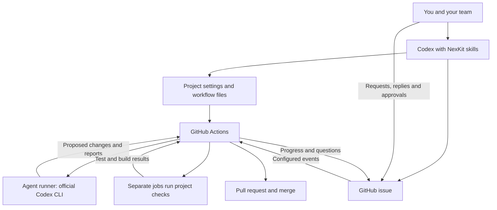
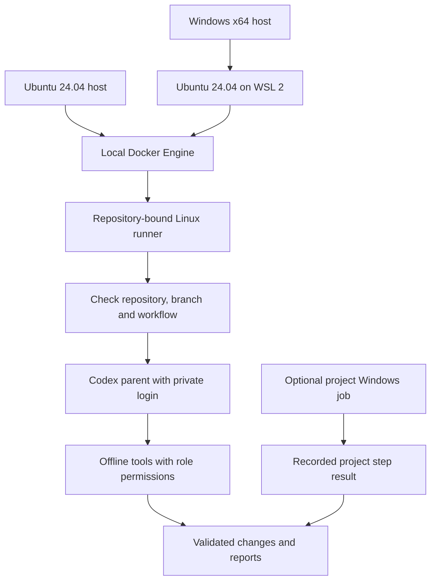
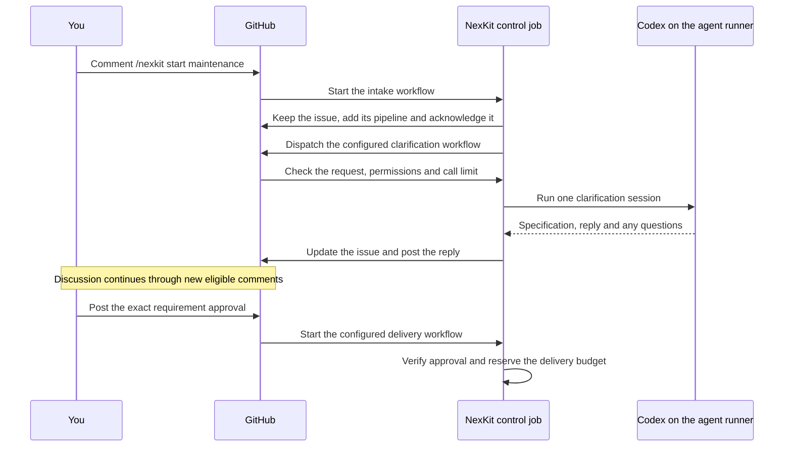
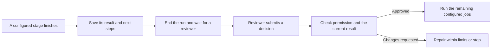

# How NexKit works

[Documentation](README.md) / How it works

NexKit connects project requirements, coding agents, verification jobs and
workflow decisions. The local assistant helps set up the project and submit
requests. The configured automation runs the accepted workflow and keeps work
moving after the local session ends.

The diagrams and execution details below describe this release's GitHub and
Codex integration. See [current support](support.md) for implemented integrations
and tested environments. Provider commands, authentication and capabilities
live in [agent adapters](agent-adapters.md); core decisions use their shared contract.

## The main pieces

```mermaid
flowchart TD
    you["You and your team"] --> host["Codex with NexKit skills"]
    host --> config["Project settings and workflow files"]
    host --> issue["GitHub issue"]
    you -->|"Requests, replies and approvals"| issue
    config --> actions["GitHub Actions"]
    issue -->|"Configured events"| actions
    actions --> runner["Agent runner: official Codex CLI"]
    runner -->|"Proposed changes and reports"| actions
    actions --> checks["Separate jobs run project checks"]
    checks -->|"Test and build results"| actions
    actions -->|"Progress and questions"| issue
    actions --> pr["Pull request and merge"]
```

| Piece | Its job |
|---|---|
| Codex plugin and skills | Help the local agent understand setup, requests, review and recovery |
| Project configuration | Records models, limits, checks, approvals, runner choices and trusted files |
| GitHub workflow files | Decide which events start work and which jobs run next |
| NexKit control jobs | Check permission and limits, save progress, publish results and decide whether work may continue |
| Agent runner | Runs the configured model through the official Codex CLI |
| Verification jobs | Execute your actual test, build, lint and end-to-end commands |
| Issue and PR | Show the requirement, discussion, changes, results and next action |

Trusted control jobs update one issue progress comment from persisted state,
linking the actual Actions attempt. Agent activity streams through a bounded
public event filter; a separate cleanup step uploads reports after the session.
Diagnostics provide visibility without changing scheduling, approval authority
or usage accounting. See [activity and recovery](operations.md#read-progress-and-recover-a-run).

A runner is a machine executing an Actions job. In subscription mode, agent
jobs use the project's dedicated runner. Control jobs, checks, merge and release
use GitHub-hosted runners. In API mode, agent jobs can also use hosted runners.
See [runner setup](self-hosted.md) for the dedicated runner's operating limits.

## Linux runtime on either host

Subscription agents run in the same repository-bound Linux container on both
host choices. Docker separates the runner from the host; Codex's tool sandbox
protects the private model login inside that container. Docker Desktop is
optional on Windows: Docker Engine runs inside Ubuntu on WSL 2.

```mermaid
flowchart TD
    linux["Ubuntu 24.04 host"] --> engine["Local Docker Engine"]
    windows["Windows x64 host"] --> wsl["Ubuntu 24.04 on WSL 2"]
    wsl --> engine
    engine --> runner["Repository-bound Linux runner"]
    runner --> admission["Check repository, branch and workflow"]
    admission --> parent["Codex parent with private login"]
    parent --> tools["Offline tools with role permissions"]
    tools --> reports["Validated changes and reports"]
    native["Optional project Windows job"] --> recorded["Recorded project step result"]
    recorded --> reports
```

Managed agent, command, check and release jobs use Linux. A project that needs
Windows tests adds an ordinary Windows workflow job and records its result with
an accepted `workflow` step. A container result does not verify native Windows
behavior. See [project steps](project-steps.md) and [Windows host setup](windows-runner.md).

## How an issue starts work

1. **Receive the request.** A CLI submission creates an issue through the intake
   workflow. `/nexkit start PIPELINE` can bring an existing issue into that flow.
2. **Clarify it.** If configured, an agent reads the project and the request.
   The bot publishes a specification and asks any needed questions on the issue.
3. **Wait for approval.** An authorized collaborator reviews the specification
   and posts the exact approval command.
4. **Run delivery.** Actions checks the approval and remaining limits before
   starting the configured jobs.
5. **Check and review.** Code changes become a candidate PR. Project checks and
   a separate AI reviewer assess that exact revision.
6. **Finish or pause.** Passing work can merge once every configured approval and
   branch rule is satisfied. Findings may start another allowed delivery round;
   a blocker or exhausted limit stops work with an explanation.

This is an example of code delivery. A project can add planning, more checks or
other jobs. The workflow YAML defines their order. The [composition reference](workflow-composition.md)
explains the reusable jobs and the conditions required for automatic merge.

NexKit 1.0.0 also supports standalone task pipelines and recorded
project steps. They reuse work-item approval, limits, state and continuation.
Their final result can be a report, with no source publication or PR. A project
step can run a command or observe an accepted native job. The
[step guide](project-steps.md) explains inputs, outputs and ownership; native YAML
still schedules every job.

## What a comment actually triggers

GitHub sends an event when someone posts a comment. The configured workflow
receives it and NexKit checks the author, issue and command. A normal reply can
start another clarification session before approval. The exact approval command
can start delivery. Unrelated comments do not authorize those actions.

```mermaid
sequenceDiagram
    participant You
    participant GitHub
    participant Control as NexKit control job
    participant Agent as Codex on the agent runner
    You->>GitHub: Comment /nexkit start maintenance
    GitHub->>Control: Start the intake workflow
    Control->>GitHub: Keep the issue, add its pipeline and acknowledge it
    Control->>GitHub: Dispatch the configured clarification workflow
    GitHub->>Control: Check the request, permissions and call limit
    Control->>Agent: Run one clarification session
    Agent-->>Control: Specification, reply and any questions
    Control->>GitHub: Update the issue and post the reply
    Note over You,GitHub: Discussion continues through new eligible comments
    You->>GitHub: Post the exact requirement approval
    GitHub->>Control: Start the configured delivery workflow
    Control->>Control: Verify approval and reserve the delivery budget
```

Each session has a defined input and timeout. Future comments start future
sessions through GitHub events. The issue discussion and saved state carry the
context between sessions.

A hash in an approval command identifies the current issue title and body.
NexKit also checks edit history, so editing a requirement and restoring its text
does not revive an old approval. The bot puts progress in comments to keep that
progress separate from the requirement being approved.

## How code, checks and review are separated

The coding agent and reviewing agent use separate sessions and workspaces. The
coding job can propose source changes. The reviewing job reads the candidate
and reports findings; it cannot change the code it is reviewing.

NexKit publishes the proposed changes, runs the project's checks and collects
the results. Jobs that execute project commands have no GitHub write token or
model credential. The jobs that publish, merge or release process the checked
reports without executing the project's code.

The model's answer is one input to the decision. Control code also checks:

- The requirement is still approved by someone with current access.
- The specification, project settings and selected NexKit version still match.
- The check and review results belong to the current code revision.
- All required checks and configured approvals are present.
- Cancellation, usage limits and branch rules still allow the next action.

If a repair is allowed, the next round receives the recorded findings and uses
the remaining budget. Retrying preserves the existing usage history.

## What happens while waiting for a reviewer

An optional approval step saves the completed result and ends the workflow run.
The runner is free while the team reviews it. An issue command or GitHub PR
review starts the configured continuation workflow.

```mermaid
flowchart LR
    result["A configured stage finishes"] --> save["Save its result and next steps"]
    save --> wait["End the run and wait for a reviewer"]
    wait --> event["Reviewer submits a decision"]
    event --> verify["Check permission and the current result"]
    verify -->|"Approved"| next["Run the remaining configured jobs"]
    verify -->|"Changes requested"| repair["Repair within limits or stop"]
```

The continuation checks that the decision still applies. It uses the saved
results and usage counters. Recorded approval waiting time does not use the
delivery execution budget, and waiting makes no model call. The configurable
waiting deadline is checked on the next event or status inspection.
See [optional approvals](stage-approvals.md).

## Where progress is stored

| Location | What it stores |
|---|---|
| Requirement issue | Original request, current specification, discussion and approval commands |
| Pull request | Proposed source changes, check results and PR reviews |
| `nexkit/state` branch | Call counts, delivery rounds, feedback, saved approval results and current status |
| Actions runs and artifacts | Job logs and the reports passed between jobs |
| Project default branch | Accepted configuration, workflow files and merged application source |

Saved counters survive retries and resumes. Workflows sharing the integration
branch use a serialized queue. Intake has a separate queue so simultaneous
submissions can be received without creating duplicate work items.

Timeline links titled `NexKit #42: ...` point to commits on `nexkit/state`.
Their JSON files are pipeline records, separate from the application branch
and its PR diff. Use the issue comments, PR and `nexkit status` to follow work;
you do not need to edit these JSON records.

After a merge or release, [issue completion](issue-completion.md) records which
approved targets were closed or kept open. Recovery can finish this step
without repeating the implementation or publication.

Artifacts normally request seven days of retention. Saved approval results can
survive the original run's artifacts; other recovery paths may still need the
original artifact bytes. The [recovery guide](operations.md) explains those
limits. State and reports are visible to repository readers. Model credentials
belong in the configured secret store or runner login directory.

## Releases are a separate workflow

When you choose to release, prepare a candidate with an exact commit, version
and release notes. Review the generated release issue and approve its current
hash. Actions then checks and builds that selected source and publishes the
configured artifacts to GitHub Releases.

Release recovery uses the original candidate and recorded artifacts. It stops
if required bytes are missing or an existing tag or asset differs. It never
moves a published tag or overwrites different release bytes.

See [daily use](daily-use.md#6-prepare-a-release-when-you-choose) for the commands,
[recovery details](operations.md) for interrupted runs, and the
[verification guide](acceptance.md) for required evidence and simulated test boundaries.
