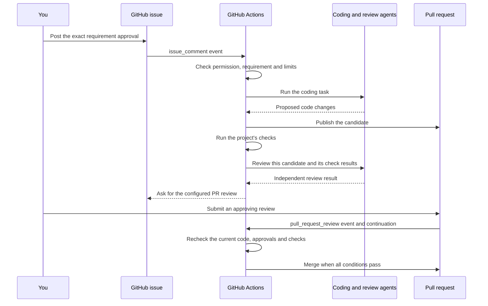
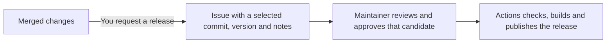

# Use NexKit day to day

[Documentation](README.md) / Daily use

This guide assumes [project setup](getting-started.md) is complete. Examples
use a pipeline named `maintenance` and issue `42`; replace them with your own.

## 1. Start a request

Choose whichever entry point is convenient.

### Create the issue yourself

Create an ordinary GitHub issue with a clear title and body. Describe the
problem, expected behavior and anything the change should preserve. Then post
this as a new, standalone comment on that issue:

```text
/nexkit start maintenance
```

Setup must have enabled existing-issue intake for this pipeline. The commenter
needs write, maintain or admin access to the repository. NexKit keeps the issue,
its original request and its discussion, then starts the configured clarification.

See [existing-issue intake](issue-intake.md) for setup details and retries.

### Ask the local agent

Select `nexkit-request` in Codex's skill picker and describe the change. In a
Codex plugin installation, the skill is named `nexkit:nexkit-request`.

> Use the maintenance pipeline to request a health endpoint. It should return
> HTTP 200 with a small JSON response. Keep the existing routes unchanged.

The agent submits the request to GitHub. If you already have an issue, give it
the URL so it can start that issue instead of creating another.

### Use the terminal

Write the request in `request.md`, then run this from the project checkout:

```sh
nexkit --pipeline maintenance request \
  --title "Add a health endpoint" \
  --body-file request.md
```

The command queues the request and returns a lookup command containing its key.
Use that command to find the issue once intake has created it. For an existing
issue, use:

```sh
nexkit --pipeline maintenance start 42
```

Use your configured pipeline name in these examples. Commands that already
take a tracked issue number can read its pipeline binding.

You can close this terminal after submission. The GitHub workflow continues on
its runners.

## 2. Discuss the requirement on the issue

The bot reads the repository and your request. It writes a specification in the
issue body and replies in comments. If it needs more information, answer in a
normal comment, for example:

> Use `/health` for the path. Return `{"status": "ok"}`. No authentication is
> needed for this endpoint.

Eligible collaborator replies trigger another clarification session within the
project's configured limits. The bot can explain its proposal or update the
specification. Prefer comments for this conversation while it is working.

This discussion happens before requirement approval. During delivery, progress
comes from the running jobs. Use the configured review or recovery steps to
change direction; ordinary delivery comments are not an unrestricted chat loop.

If this pipeline uses a manually written specification, its intake notice gives
the `nexkit spec` and `nexkit approval` commands instead. Publishing it with
`nexkit spec` queues an intake run. GitHub Actions updates the issue and posts
the exact approval command as `github-actions[bot]`, without a model call.
Wait for that notice before approving. The CLI uses your login to start the run;
it does not post the workflow's reply under your name. Repeating the same
publication recovers a missing bot notice without editing the specification or
adding a duplicate bot comment. If the issue changes while the update is queued,
read the new version and submit the specification again.

The issue keeps the original request in a collapsed section. Open it when you
need that history; the visible specification is the requirement being reviewed.

A ready specification includes one `## Acceptance criteria` section containing
an explicit Markdown list. Give criteria stable IDs, for example
`- [AC1] Negative integers are summed correctly.` The controller derives IDs
from criterion text for existing lists without IDs. An approving reviewer must
cover every candidate criterion ID exactly once with current evidence; omitted,
duplicate or invented criteria block acceptance. Old specifications without an
explicit list need a reviewed specification update and fresh approval.

## 3. Approve the specification

Read the current specification and acceptance criteria. When the bot says it is
ready, copy its exact command into a new comment:

```text
/nexkit approve <hash-from-the-bot>
```

The hash identifies the issue title and body being approved. `42` identifies the
issue; it is not an approval hash. A message such as "approved" does not replace
the command. The approver must have current write, maintain or admin access.

You can retrieve the current command from the terminal:

```sh
nexkit approval 42
```

Post the returned command yourself after reviewing the requirement. An agent
must not approve it on your behalf. Changing the requirement invalidates its
previous approval.

If the change completes several issues, list them in the specification's
`Issues to close` section before approval. Ordinary mentions stay references.
See [issue completion](issue-completion.md) for the format and how to keep a
partially completed umbrella issue open.

## 4. Follow the work and review when asked

A valid approval comment is a GitHub event. Actions checks it and starts the
configured delivery workflow. The following diagram shows a workflow that also
requires a PR review before merge:



Job order comes from your project's workflows. Checks, separate AI review,
repair rounds and any additional approval steps follow that setup.
Open **View current run** in the issue's **NexKit progress** comment to follow
the exact Actions attempt. During execution, the agent step shows timestamped
messages, commands, file changes and a process heartbeat. After the job ends,
its summary links the full report and activity artifact, retained for seven days.
See [reading activity and recovering a run](operations.md#read-progress-and-recover-a-run)
for log contents and interrupted runs.
After merge, NexKit closes the selected completed issues when enabled and
posts a short summary. Release candidates close after successful publication.

For a PR approval, open **Files changed → Review changes → Approve → Submit
review**. To ask for a correction, use **Request changes** and explain what is
needed. Another delivery round may run if the policy allows it and budget remains.

For an approval on the issue, the bot provides commands such as:

```text
/nexkit approve-stage <gate> <checkpoint-hash>
```

Copy the actual command from that notice. A requirement approval, stage approval
and PR review each apply to their own result. See [optional approvals](stage-approvals.md).

## 5. Check status, cancel or resume

Use the issue's progress updates and links to Actions and the PR. From your
project checkout, these commands accept the issue number and read its pipeline
binding automatically:

```sh
nexkit status 42
nexkit cancel 42
nexkit resume 42
```

| Action | What it does |
|---|---|
| `status` | Reads the saved state and shows the current work or approval wait |
| `cancel` | Requests a stop; jobs check cancellation before later operations |
| `resume` | Continues eligible work after a blocker is fixed, keeping approval and usage history |

You can also comment `/nexkit cancel` or `/nexkit resume` on the issue.
Cancellation does not undo commits or a completed merge. Resume does not grant
approval or refill the usage budget. Inspect the latest Actions run before
retrying a failure. See [troubleshooting](operations.md) for common cases.

For interrupted work, inspect `nexkit recovery 42` and
`nexkit resume 42 --dry-run`. After reviewing exhausted work, an actual
administrator may approve bounded extra capacity through `nexkit budget 42`.
This preserves the same issue and all spent usage. See [work recovery](recovery.md).

## 6. Prepare a release when you choose

Merging changes does not automatically create a release candidate. You can merge
several changes before preparing one. The project must have release support
configured.



Select a full commit SHA and write release notes in `release-notes.md`. For
example, the following selects the current commit in your checkout:

```sh
git rev-parse HEAD
nexkit --pipeline maintenance release \
  --commit FULL_COMMIT_SHA \
  --version 0.2.0 \
  --notes-file release-notes.md
```

Replace `FULL_COMMIT_SHA` with the commit you inspected and choose your actual
version. The command queues a release candidate issue with readable notes and
the selected source. Use the returned lookup command to find it.

Review that issue. When you want to publish, post the exact command it supplies:

```text
/nexkit release <hash-from-the-bot>
```

Actions then checks and builds the approved source and publishes the configured
GitHub release. This version supports GitHub release artifacts; package-registry
publishing and production deployment need separate integrations.

## Command reference

| Where | Command | Purpose |
|---|---|---|
| Issue comment | `/nexkit start PIPELINE` | Start intake for this existing issue |
| Issue comment | `/nexkit approve HASH` | Approve the exact requirement shown by the bot |
| Issue comment | `/nexkit approve-stage GATE HASH` | Approve a configured stage result |
| Issue comment | `/nexkit request-changes GATE HASH` followed by feedback | Request changes at an issue approval step |
| Release issue comment | `/nexkit release HASH` | Approve the selected release candidate |
| Issue comment | `/nexkit cancel` or `/nexkit resume` | Request a stop or recovery |
| Terminal | `nexkit status ISSUE` | Read saved progress |
| Terminal | `nexkit doctor --online --checks` | Inspect the project setup and run its declared checks |

Use the bot's current hashes and the project's actual pipeline and gate names.

Next: [how it works](architecture.md) or [change project settings](project-setup.md).
