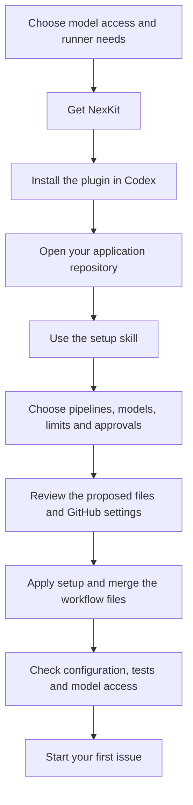

# Install and set up with Codex

[Documentation](README.md) / Getting started

Start with the [setup roadmap](setup-roadmap.md) to choose model access and see
the full order of steps. This guide uses Codex to prepare your project's setup.
To do the work in a terminal and editor, follow [manual setup](manual-setup.md).

There are three parts to guided setup:

1. **Install the plugin** on your setup computer.
2. **Configure the repository:** review and install its settings, workflows and
   GitHub permissions.
3. **Provision the runner and model access:** subscription mode needs a dedicated
   container and login; API mode needs its Actions secret. Verify a small request.

Codex helps prepare the project files. You choose the settings and
review the proposed changes.

These are separate steps. Plugin installation supplies local skills; repository
setup records accepted decisions; runner provisioning supplies the environment
that executes the workflows. Follow [runner administration](self-hosted.md) or
[Windows host setup](windows-runner.md) after the repository files are accepted.



## 1. Prepare your tools and repository

You can prepare the configuration before provisioning a runner. API access with
GitHub-hosted agent jobs needs no VPS. Subscription mode needs your own supported
Linux container runner before live model jobs can run. Windows hosts use
Ubuntu under WSL 2 and Docker Engine. See the
[runner choice table](setup-roadmap.md#1-choose-how-the-pipeline-will-run).

You need:

- Python 3.11 or later and Git.
- GitHub CLI, authenticated to the account that will manage setup. NexKit needs
  a version with `gh api --slurp`; version 2.101.0 was used for acceptance.
- Codex CLI with `codex plugin` support.
- A GitHub repository with a default branch and a local checkout. A new project
  can start with a README; an existing project keeps its code and conventions.
- Access to manage the repository's Actions settings and branch rules, or an
  administrator who can apply those setup changes.

These commands show your installed versions and GitHub login status:

```sh
python3 --version
git --version
gh --version
gh auth status
codex --version
codex plugin --help
```

If GitHub CLI needs a login, run `gh auth login`. Complete any Codex sign-in
prompt when you open Codex. Your interactive login and the login used
by a CI runner are configured separately.

## 2. Get NexKit and make its command available

Keep NexKit in a tools directory alongside your projects:

Install version 1.2.1 from its release tag. Project setup records the full
commit SHA so each workflow uses the same immutable NexKit source.

```sh
git clone --branch v1.2.1 https://github.com/phuongnse/nexkit.git
cd nexkit
export PATH="$PWD/bin:$PATH"
nexkit --version
```

On native Windows, use PowerShell:

```powershell
git clone --branch v1.2.1 https://github.com/phuongnse/nexkit.git
Set-Location nexkit
$nexkitSource = (Get-Location).Path
$env:Path = "$nexkitSource\bin;$env:Path"
nexkit --version
```

Use `python --version` to check Windows Python. In the following plugin commands,
use `$nexkitSource` in place of `$PWD`. Use `Set-Location` to open your application
directory. To keep the launcher available in new terminals, add the toolkit's
`bin` directory to your Windows user `Path` setting.

An extracted installation archive can be used in place of the Git checkout.
The `bin/nexkit` command runs directly from that directory. Building an archive
is a development task; the source checkout is ready to use.

The `export` above lasts for the current terminal. To keep the command available,
add this line to your shell profile, using the real absolute path:

```sh
export PATH="/absolute/path/to/nexkit/bin:$PATH"
```

Open a new terminal after saving the profile. Keep the NexKit directory in place
while using its command.

## 3. Install the plugin in Codex

From the NexKit directory:

```sh
codex plugin marketplace add "$PWD"
codex plugin add nexkit@nexkit
```

The bundled marketplace is named `nexkit` and displayed as **NexKit**.
The selector `nexkit@nexkit` means the `nexkit` plugin from the `nexkit`
marketplace. Use the **NexKit repository root**
for the first command; that directory contains the marketplace catalog and the
plugin it points to. Use a Codex CLI with plugin support. The
[official marketplace guide](https://developers.openai.com/plugins/build/plugins#add-a-marketplace-from-the-cli)
explains local and Git sources.

Alternatively, add the released marketplace directly from GitHub instead of
registering the local checkout:

```sh
codex plugin marketplace add phuongnse/nexkit --ref v1.2.1
codex plugin add nexkit@nexkit
```

Either source installs the same nine plugin skills. Keep the toolkit CLI from
step 2 available separately; plugin installation does not add `nexkit` to `PATH`
or configure an application's GitHub workflows and model access.

Now open a new session from your application repository:

```sh
cd /path/to/your-project
codex
```

Type `$` and select `nexkit:nexkit-init`. The skill picker is useful because it
shows the exact name loaded by your installation.

### Project skills

The setup installer also copies Codex skills into your project. These live under
`.agents/skills/` and use names such as `$nexkit-init`.

Choose the installed plugin skill or the project skill shown in Codex. See
[supported paths](support.md) for the installation and verification scope.

## 4. Describe the setup you want

Start with a normal request to the setup skill:

> Set up NexKit for this repository. Read the README, project instructions,
> workflows and test commands first. Suggest the pipelines this project needs.
> Help me choose model access, execution limits and approval steps, then show
> the proposed files and GitHub settings.

If the agent needs the NexKit reference files, give it the path to your NexKit
checkout. The CLI and the `docs/` directory are there alongside the plugin.

If you already know your preferences, include them. For example:

> Use a pipeline named maintenance for code changes. Add a PR review before
> merge and let any collaborator with write access review it. I have a Linux
> VPS and want to discuss using my Codex subscription. Show the model, reasoning
> and limits before enabling a live run. Enable `/nexkit start maintenance`
> for issues I create myself.

The agent will use your project's actual commands and conventions. A project
can have one pipeline or several, and each can have different jobs and settings.
See [project configuration](project-setup.md) for the choices in plain language.

## 5. Choose where agents run and how they sign in

| Choice | What you provide | Where agent jobs run |
|---|---|---|
| OpenAI API authentication | An API project and the `OPENAI_API_KEY` Actions secret | GitHub-hosted runners, or an explicitly configured agent runner |
| ChatGPT subscription authentication | Your own supported Linux or Windows runner and a Codex login for that project | The project's dedicated runner |

API usage is billed through OpenAI Platform. ChatGPT sign-in uses the account's
Codex access and allowance. See [OpenAI authentication](https://learn.chatgpt.com/docs/auth)
for the distinction. Models must be available to the selected account.

For API mode, your administrator can add the secret with an interactive prompt:

```sh
gh secret set OPENAI_API_KEY --repo OWNER/REPO
```

Replace `OWNER/REPO` with your project. Enter the key at the prompt; keep it out
of project files and issue comments.

For subscription mode, follow [the runner setup guide](self-hosted.md). It
covers provisioning, isolation and device login. Start login on the runner;
you can open the displayed device-login page in a browser on your personal
computer. Installing the plugin does not create that runner or copy a login.

**Public-repository subscription mode is experimental.** OpenAI's
[account authentication guide for CI](https://learn.chatgpt.com/docs/auth/ci-cd-auth)
limits its documented flow to trusted private automation. NexKit's public mode
is a custom integration with its own controls and acceptance evidence.

Each project selects its own runner and account access. Without your own runner,
the integrated GitHub-hosted/API path is available. Both authentication modes
use the official Codex CLI for pipeline jobs.

## 6. Review and apply the project setup

The agent should show you:

- Pipeline names and the jobs each one will run.
- Models, reasoning, runner, time limits and call limits.
- Test commands and any dependency setup.
- Approval steps and who can approve.
- Files to add or change, including the GitHub workflow files.
- GitHub settings and model access that need an administrator's action.

Approve the concrete setup when it matches your project. The agent then installs
the accepted files and helps apply the [GitHub settings](github-setup.md).
Workflow files must be committed and merged to the project's default branch
before issue comments can start them. Existing branch rules still apply to
that setup change.

A typical project then contains:

```text
your-project/
├── .nexkit/
│   ├── project.json          # Your accepted settings
│   ├── installation.json     # Files tracked by the installer
│   └── controls/             # Project task instructions, when configured
├── .github/workflows/        # Your actual pipeline jobs and triggers
└── .agents/skills/           # Project skills, when installed for Codex
```

For a composed workflow, the installer takes a proposed configuration and a
directory containing the workflow files. The
[setup guide](project-setup.md#apply-a-prepared-configuration) shows the preview
and apply commands. The [manual walkthrough](manual-setup.md) also explains how
to create those files yourself, starting from a complete editable example.

## 7. Check readiness and start a request

From your project checkout:

```sh
nexkit doctor --online --checks
```

This checks the installed files, declared application checks and GitHub settings.
For a dedicated runner, it also checks registration and labels. Live model
access is a separate check; setup should agree on a small live request and its
usage limit before claiming that the complete path works.

An empty application can report that its behavior checks are not ready yet.
Keep that result visible while preparing the first approved implementation.

Once setup is ready, follow [your first request](daily-use.md#1-start-a-request).
You can start directly from a GitHub issue or ask the `nexkit-request` skill to
create one for you.

Finish by adding the pipeline names and operating instructions to your project's
README. The [handover checklist](setup-roadmap.md#6-hand-the-project-over-to-its-users)
explains what collaborators need for daily work.
