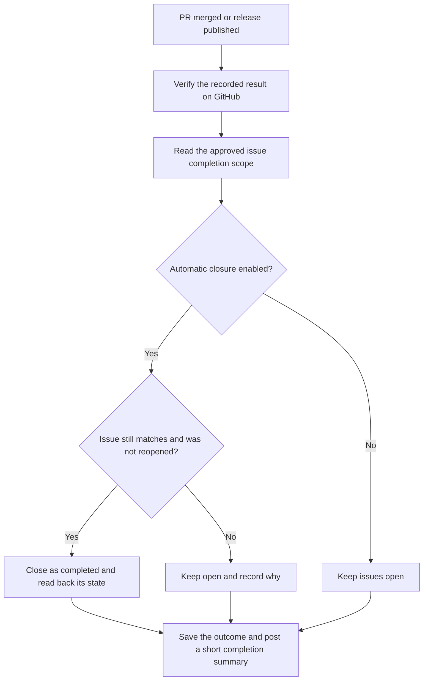

# Close completed issues

[Documentation](README.md) / Issue completion

By default, NexKit closes a requirement issue after its reviewed PR merges into
the repository's default branch. It closes a release candidate issue after the
approved GitHub release is published with the expected artifacts. These are
separate events: merging code does not publish a release.

This behavior is included in NexKit 1.0.0.
Consumers must deliberately select the reviewed kit pin for their future runs.

## Choose the policy during setup

Put these settings in `defaults` or `pipelines.<name>.settings` in
`.nexkit/project.json`:

```json
{
  "issue_completion": {
    "close_after_merge": true,
    "close_after_release": true
  }
}
```

Each omitted setting defaults to `true`. Set either to `false` when your team
wants to close those issues itself. The init skill can make this choice with
you, or you can include it in a manual setup proposal. `nexkit doctor` shows
the effective settings for each pipeline. Existing work keeps its recorded
completion policy; a setup change applies to new delivery reservations.
The consumer workflow must allow `issues: write` for the trusted prepare,
finish, release publication and recovery jobs. Agent and build jobs keep their
existing read-only or credential-free permissions.

## One PR can complete several issues

Without a special section, the requirement issue itself is the completion
target. To choose a different list, add this section to the specification
**before approving it**:

```markdown
## Issues to close

- #42
- #57
```

This is the entire list. Include the requirement issue's own number if that
issue should close too. Each entry must be an issue in the same repository.
Use one list entry per issue, with at most 20 entries. To keep an umbrella issue
open after a partial delivery, omit it from the list or select no issues:

```markdown
## Issues to close

None.
```

A completed NexKit work item stays completed even when its issue is kept open.
Use a separate requirement for a later delivery and reference the umbrella
issue when it still has remaining work.

Mentions elsewhere in the specification, comments, code examples and PR text
do not add targets. Changing the list changes the approved specification and
requires a new approval. Additional targets must be ordinary issues without
their own NexKit work record. Complete separately tracked work through its own
pipeline so its approvals and results stay together. Release candidate issues
cannot be closed by a delivery PR.

NexKit reads each additional issue before starting delivery. An issue created
or edited after requirement approval needs a fresh approval of the current
scope. The saved title and body go to both the implementer and independent
reviewer. Review must provide evidence that each selected issue is fully
resolved. An issue that changes during delivery blocks the old candidate.

## What happens after merge or publication



Generated PRs use references and a readable completion list. NexKit performs
the closure explicitly after checking the result, rather than relying on
GitHub's automatic closing keywords. If you add closing keywords or manual
closing links yourself, GitHub may close those issues according to its own
[linking rules](https://docs.github.com/en/issues/tracking-your-work-with-issues/using-issues/linking-a-pull-request-to-an-issue).
When an approved scope changes during a repair, NexKit refreshes its marked
summary in the PR description and preserves notes outside that section.

Already closed issues are left as they are. A later reopen is not undone by
replaying the completed workflow. A changed issue or an issue taken over by
another NexKit work item stays open. GitHub does not provide an atomic
comparison of an issue's text and state for this update, so NexKit rechecks
immediately before closing and reads the result back.

## Recover a missing closure

A network or permission failure can leave the work merged or released while
issue completion is pending. `nexkit status 42` shows the completion record and
reason. Repeating the completed delivery or release entrypoint retries this
step without consuming another model call, rebuilding or publishing again.

You can also use the terminal from your configured project checkout:

```sh
nexkit complete 42
nexkit complete 42 --apply
```

The first command previews the result without writing to GitHub. The second
closes only verified completed issues and posts a summary. It needs permission
to write issues and the `nexkit/state` branch. Completion requires the scope
recorded during approved work, the merged candidate or published release and
its verified assets. A missing completion record cannot authorize closure.

Reopened or changed issues need a person's decision. A completion retry cannot
override that decision or turn unfinished work into completed work.
