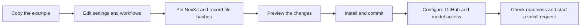

# Set up NexKit manually

[Documentation](README.md) / Manual setup

You can do this with a terminal and a text editor. No interactive agent or
plugin installation is needed to prepare and install the project. Read the
[setup roadmap](setup-roadmap.md) first to choose API or subscription access.

This walkthrough starts with one pipeline named `maintenance`. It receives an
issue, clarifies the request, waits for requirement approval, then uses NexKit's
built-in delivery adapter to implement, check, review and merge a change.
The name and structure are example choices. For a different job sequence or
optional PR approval, use [individual jobs](agent-invocations.md) and
[stage approvals](stage-approvals.md) when editing the proposal in step 3.



## 1. Prepare the repository and toolkit

You need Python 3.11+, Git and an authenticated GitHub CLI (`gh`). An
administrator must be able to manage this repository's Actions and branch
settings. The shell examples use Bash; the PowerShell alternatives below cover
Windows host setup through WSL 2.

Create your application repository on GitHub if it does not exist. Initialize
its default branch, for example with a README, and clone it to your computer.
An existing application keeps its source files and conventions.

If you do not have a NexKit checkout yet, run this in your tools directory:

```sh
git clone --branch v1.1.0 https://github.com/phuongnse/nexkit.git
```

This checks out version 1.1.0. The setup script uses its full commit SHA for
the project's configuration and workflow references.

Set these paths for the rest of this terminal session:

```sh
export NEXKIT_SOURCE="/absolute/path/to/nexkit"
export NEXKIT_PROJECT="/absolute/path/to/your-project"
export PATH="$NEXKIT_SOURCE/bin:$PATH"
cd "$NEXKIT_PROJECT"
nexkit --version
gh auth status
nexkit survey
```

In PowerShell:

```powershell
$env:NEXKIT_SOURCE = 'C:\tools\nexkit'
$env:NEXKIT_PROJECT = 'C:\projects\your-project'
$env:Path = "$env:NEXKIT_SOURCE\bin;$env:Path"
Set-Location $env:NEXKIT_PROJECT
nexkit --version
gh auth status
nexkit survey
```

Use `gh auth login` if needed. `survey` reads project context; it does not call
a model. Review existing workflows, instructions, dependencies and test commands
before choosing settings. Keep the toolkit checkout at the revision you intend
to use in CI.

**Done when:** the commands are available, GitHub login works, and you know
which repository, branch and application checks you are configuring.

## 2. Copy a complete proposal

Create a temporary proposal directory outside your application. This command
copies the example's configuration and its hidden workflow directories:

```sh
export NEXKIT_PLAN="$(mktemp -d)"
cp -R "$NEXKIT_SOURCE/docs/examples/manual-setup/." "$NEXKIT_PLAN/"
printf '%s\n' "$NEXKIT_PLAN"
```

In PowerShell:

```powershell
$env:NEXKIT_PLAN = Join-Path ([IO.Path]::GetTempPath()) ('nexkit-proposal-' + [guid]::NewGuid())
New-Item -ItemType Directory -Path $env:NEXKIT_PLAN | Out-Null
Copy-Item -Path "$env:NEXKIT_SOURCE\docs\examples\manual-setup\project.json","$env:NEXKIT_SOURCE\docs\examples\manual-setup\branch-rules.json" -Destination $env:NEXKIT_PLAN
Copy-Item -LiteralPath "$env:NEXKIT_SOURCE\docs\examples\manual-setup\bundle" -Destination "$env:NEXKIT_PLAN\bundle" -Recurse -Force
$env:NEXKIT_PLAN
```

The explicit `bundle` copy includes its hidden `.github` directory.

Keep the printed path until setup is finished. The files are:

```text
proposal/
├── project.json
├── branch-rules.json
└── bundle/
    └── .github/workflows/
        ├── capture.yml
        ├── discuss.yml
        └── change.yml
```

The bundle holds the files to install at those same paths in your project.
Open `project.json` and the three workflows in your editor. The
[example README](examples/manual-setup/README.md) explains each file.

## 3. Edit the proposal for your project

In `project.json`, review every choice below:

| Field | What to put there |
|---|---|
| `repository`, `default_branch` | Your actual GitHub `OWNER/REPO` and default branch |
| `defaults.models`, `defaults.reasoning_effort` | Models available to your account and supported reasoning values |
| `defaults.limits` | Accepted delivery rounds, calls, elapsed minutes and command timeouts |
| `defaults.clarification` | Per-call minutes and conversation-count limit; `max_calls: null` allows more replies without a count cap |
| `defaults.environment` | Linux managed job selectors, runner labels and dependency setup argument arrays |
| `defaults.checks` | Your actual test and end-to-end commands and their report formats; include build/lint when relevant |
| `defaults.application` | `present` for an existing app, `absent` for a new app that still needs implementation |
| `defaults.knowledge`, `defaults.decisions` | Your project's context paths and accepted decisions |
| `defaults.merge_method` | A merge method enabled for your repository |
| `pipelines` | The pipeline names, workflow entrypoints and model-bearing workflows you select |

The sample uses `gpt-6-luna` with `max` reasoning, up to three clarification
calls, and two delivery rounds with four delivery calls. These are editable
example values, not defaults applied to every project.

The sample checks are for Python unittest suites in `tests/unit` and
`tests/e2e`. Replace them with your real commands. Supported behavior reports
are JUnit, TAP and unittest; JUnit also needs its output path. An empty suite or
a command such as `echo passed` does not verify application behavior. An empty
application can declare intended checks, but cannot claim they pass yet.

If you rename `maintenance`, change the JSON pipeline key and the literal
`pipeline: maintenance` in `discuss.yml` and `change.yml`. If you rename a
workflow, update its entrypoint and `agent_workflows` references too.

### For API access

Keep `engine.auth: api-key` and use `ubuntu-24.04` for the managed application
and agent runner selectors. Add ordinary Windows jobs as project workflow
steps when your application requires Windows checks.
The example forwards `OPENAI_API_KEY` to its clarification and delivery jobs.
You will add that repository secret in step 7. No VPS is needed.

### For subscription access

In `defaults`, set:

```json
{
  "engine": {"name": "codex", "auth": "chatgpt"},
  "environment": {
    "runner": "ubuntu-24.04",
    "agent_runner": ["self-hosted", "linux", "x64", "your-project-runner"],
    "setup": []
  }
}
```

This is a fragment; retain the other settings and any real dependency setup.
Choose one project-specific lowercase runner label. Remove the `secrets` block
from `discuss.yml` and `change.yml` because this mode uses the runner's login.
Before finalizing the bundle, read
[runner preparation](self-hosted.md#prepare-a-runner-binding), including
the administrative probe workflow's explicit binding. The host can be
provisioned after you finish the proposal.

On a Windows host, keep these Linux runner settings and follow the
[Windows host guide](windows-runner.md) to prepare Ubuntu under WSL 2 and
Docker Engine. Docker Desktop is not required.

### Approvals and releases in this example

Requirement approval and a separate AI review are required. This particular
example has no additional person reviewing the PR, and releases are disabled.
If your team requires PR approval, add the composed workflow, approval policy
and continuation events from the [approval guide](stage-approvals.md) before
proceeding. Match the GitHub review rule to that policy in step 6.

Do not turn an existing team's review requirement off to copy this example.
Additional pipelines and release entrypoints are deliberate setup choices.

## 4. Pin NexKit and record the workflow hashes

The example contains a zero commit pin and an empty `files` map. This snippet
replaces the pin with your toolkit checkout's exact commit and computes SHA-256
hashes for the edited bundle. Save the Python block below as `prepare.py` in
your temporary proposal directory. It changes only the proposed files:

```python
import hashlib
import json
import os
from pathlib import Path
import subprocess
import sys

source = Path(os.environ["NEXKIT_SOURCE"])
plan = Path(os.environ["NEXKIT_PLAN"])
config_path = plan / "project.json"
config = json.loads(config_path.read_text(encoding="utf-8"))
if config["repository"] == "OWNER/REPO":
    raise SystemExit("Set your repository in the proposed project.json first.")
kit_ref = subprocess.check_output(
    ["git", "-C", str(source), "rev-parse", "HEAD"], text=True
).strip()
old_ref = config["kit"]["ref"]
config["kit"]["ref"] = kit_ref
config["kit"]["version"] = subprocess.check_output(
    [sys.executable, "-I", str(source / "bin/nexkit"), "--version"], text=True
).strip()
files = {}
bundle = plan / "bundle"
for path in sorted(bundle.rglob("*"), key=lambda path: path.relative_to(bundle).as_posix()):
    if not path.is_file():
        continue
    relative = path.relative_to(bundle).as_posix()
    if relative.startswith(".github/workflows/"):
        path.write_bytes(path.read_bytes().replace(old_ref.encode(), kit_ref.encode()))
    files[relative] = {
        "sha256": hashlib.sha256(path.read_bytes()).hexdigest(),
        "managed": True,
    }
config["files"] = files
config_path.write_text(json.dumps(config, indent=2) + "\n", encoding="utf-8", newline="\n")
print(f"Prepared {len(files)} files using NexKit {kit_ref}")
```

Run it in Bash with `python3 "$NEXKIT_PLAN/prepare.py"`, or in PowerShell with
`python "$env:NEXKIT_PLAN\prepare.py"`.

Review the result. The pinned commit must be available in `kit.repository` on
GitHub; local uncommitted changes are not part of that pin. Re-run this step if
you edit a bundled workflow before installing it.

This snippet is for this example's fully managed bundle. If you include
existing project-owned controls with `managed: false`, preserve their ownership
and hash them separately as described in [workflow composition](workflow-composition.md).

**Done when:** the proposal contains your settings, full kit pins and a hash
for every selected workflow/control file.

## 5. Preview, install and commit the files

From the application checkout, preview without writing project files:

```sh
cd "$NEXKIT_PROJECT"
nexkit install --config "$NEXKIT_PLAN/project.json" \
  --bundle "$NEXKIT_PLAN/bundle"
```

Read the additions, updates and ownership decisions. Reconcile any collision
with an existing file before applying the proposal:

```sh
nexkit install --config "$NEXKIT_PLAN/project.json" \
  --bundle "$NEXKIT_PLAN/bundle" --apply
git status --short
git diff
```

In PowerShell, use one command per line:

```powershell
Set-Location $env:NEXKIT_PROJECT
nexkit install --config "$env:NEXKIT_PLAN\project.json" --bundle "$env:NEXKIT_PLAN\bundle"
nexkit install --config "$env:NEXKIT_PLAN\project.json" --bundle "$env:NEXKIT_PLAN\bundle" --apply
git status --short
git diff
```

Read the preview before running the line with `--apply`.

The installer copies Codex project skills into `.agents/skills/`. It does not
start Codex or require a local Codex login. No host selection is needed.

`install --apply` writes `.nexkit/project.json`, the accepted
bundle, the skills and `.nexkit/installation.json`. `nexkit setup --apply` also
runs readiness checks immediately. This walkthrough uses `install` so you can
finish GitHub and model access before running those checks in step 8.

Review new files as well as `git diff`, then commit and publish the intended
files using your repository's normal process. Include the project configuration,
installation record, installed skills and selected workflows/controls. The
temporary proposal and `branch-rules.json` do not need to be committed.

For a new repository with no branch policy, put these initial setup files on
the default branch before enabling the rules in step 6. For an existing
protected repository, use its approved setup-change process and preserve its
required reviews and checks. A setup change cannot use passing delivery results
from an unrelated candidate.

**Done when:** the exact accepted files are on the default branch. Keep your
local checkout synchronized with that revision for the remaining checks.

## 6. Configure GitHub

Follow [GitHub setup](github-setup.md). It covers enabling the required Actions
permissions, preserving existing verification, matching branch rules and
applying the included rule proposal to a repository without existing rules.

The local installer does not change these settings. Apply them as the repository
administrator before starting requests.

## 7. Configure the selected model access

### API mode

With API billing and a suitable model available to your OpenAI API project,
add the secret through GitHub CLI's prompt:

```sh
gh secret set OPENAI_API_KEY --repo OWNER/REPO
```

Use your actual repository name. Enter the key at the prompt; do not put it in
the configuration or commit it. See [API authentication](configuration.md#openai-api-authentication-for-actions).

### Subscription mode

On the supported Linux or Windows machine, use the same pinned toolkit and your accepted
configuration. Follow the [runner guide](self-hosted.md) in order:

1. Follow the selected OS's runner guide; preview and provision with `--pipeline maintenance`.
2. Verify runner admission, sandbox and networking before adding a login.
3. Start device login in that project's runner environment and complete it
   with the account owner. The browser can be on another computer.
4. Start the runner service and inspect its online status and labels.

Follow the runner guide's instructions for the administrative probe's controlled
use. Use your actual pipeline name when it differs from `maintenance`. No API
secret is needed for this mode.

## 8. Check readiness, then verify a real request

From the synchronized application checkout:

```sh
nexkit doctor --online --checks
```

Resolve the reported configuration, permission, runner or application-check
problems. This command runs your declared checks and inspects GitHub, but does
not call a model. A new application can still report missing behavior checks;
keep that limitation visible for its initial implementation.

Choose a small first request and confirm its call/time limits. Create a GitHub
issue describing it and post:

```text
/nexkit start maintenance
```

Starting it can spend a clarification call. You should see an intake notice,
an Actions run, then a specification or questions from the bot. Reply on the
issue. Approve only the specification you accept, using the exact command the
bot provides. Approval starts delivery within the configured limits.

Track the resulting PR, real application checks, separate AI review and merge.
Record which stages actually completed; configuration readiness alone is not
live acceptance. Then add the project's pipeline names and operating instructions
to its README using the [handover checklist](setup-roadmap.md#6-hand-the-project-over-to-its-users).

## Change the setup later

Keep a proposed copy of the accepted configuration and workflow bundle outside
the installed files. Edit that proposal, refresh changed hashes, preview and
apply through `nexkit install`, then publish it through the project's setup
process. Keep the kit pin unchanged unless you intend to upgrade NexKit.

For GitHub rules or runner admission changes, update the corresponding
administrative settings as well. Review in-progress work before changing its
accepted configuration. The [project setup guide](project-setup.md#change-settings-later)
explains the same update process with an assistant.

Next: [daily use](daily-use.md) or [troubleshooting](operations.md).
