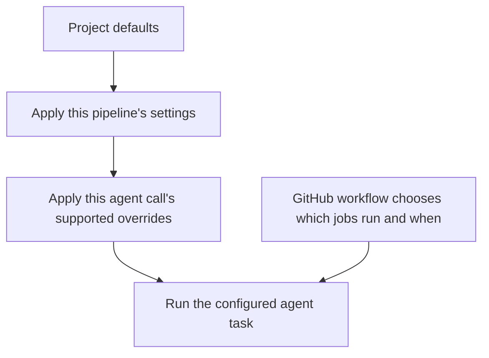

# Configure your project

[Documentation](README.md) / Project setup

Use this guide to understand the choices for initial setup and later changes.
The `nexkit-init` skill can prepare them from a conversation: it reads your
project, prepares the configuration and workflows, and shows the changes for
review. You can also [prepare and install the files manually](manual-setup.md).
For prerequisites and setup order, start with the [roadmap](setup-roadmap.md).

For example:

> Keep a maintenance pipeline for code changes. Use gpt-6-luna with max reasoning
> for coding and review. Require one PR approval from a repository collaborator
> before merge. Let us discuss requirements without a fixed conversation-count
> limit, but keep automatic delivery within the limits we agree on.

The model and numbers in this guide are examples. Choose models your account
can use and limits that fit your project.

## Decide what the project needs

| Decision | What to choose yourself or tell the setup agent |
|---|---|
| Pipelines | The kinds of work you want to automate, and how each should start |
| Stages | What should happen before coding, after coding and before merge |
| Models | Which model and reasoning effort to use for each agent task |
| Runner and login | Where jobs run and whether agents use an API key or a configured subscription runner |
| Checks | The real commands for tests, end-to-end checks, build and lint |
| Limits | How many delivery rounds and calls to allow, and their time limits |
| Conversation | How long each clarification call can run and whether to cap the number of calls |
| Approvals | Where to wait for a person, who can approve and how many approvals are needed |
| Issue completion | Whether to close completed issues after merge and release; see [the completion guide](issue-completion.md) |
| Knowledge | README, architecture notes and other project instructions the agents should read |
| Release | Whether to enable release requests, the build command and output files |

The number and names of pipelines belong to your project. A small project may
use one delivery pipeline. Another may add planning, an audit workflow or extra
checks. NexKit supplies skills and reusable jobs that setup can connect.

For a step specific to your project, supply an agent task, a script or a native
GitHub job. NexKit 1.0.0 can also run standalone task pipelines that
finish with a report instead of a PR. [Build a pipeline from steps](project-steps.md)
explains both choices, their configuration and the current verification boundary.

Automatic code delivery still requires an approved requirement, real checks
and a separate AI review before merge. Optional approval steps add to those
conditions. Native GitHub Actions YAML defines the actual jobs and their order.

## Where the configuration lives

| File or directory | Purpose | How to change it |
|---|---|---|
| `.nexkit/project.json` | Accepted project settings, pipeline names and references to trusted files | Prepare a separate proposed update, manually or with the setup skill |
| `.github/workflows/*.yml` | Events, jobs, dependencies and runner permissions | Include changes in the proposed setup bundle |
| `.nexkit/controls/` | Project instructions used by specific agent jobs, when configured | Update them as part of setup |
| `.nexkit/installation.json` | Records which files the installer manages | Let the installer maintain it |
| `README.md` and chosen knowledge files | Product and technical context for agents | Maintain them with normal project changes |

A setup bundle is a directory containing the proposed workflow and control
files, with the same paths they will have in your repository. The configuration
records their hashes so a running job can check that it is using the accepted
files. The setup agent can prepare these details; the
[manual guide](manual-setup.md#4-pin-nexkit-and-record-the-workflow-hashes) shows
how to create the bundle and calculate its hashes yourself.

## Shared settings, pipeline settings and individual calls

Project configuration uses **schema 1**. It has three places for settings:

1. `defaults`: values shared by pipelines in this repository.
2. `pipelines.<name>.settings`: changes for one pipeline.
3. `pipelines.<name>.invocations.<name>`: model, task, reasoning and timeout for
   one explicitly configured agent call.

Project commands and native jobs use `pipelines.<name>.steps`; approvals use
`pipelines.<name>.approvals`. Both belong to the chosen pipeline. GitHub YAML
continues to determine dependencies and conditions.



Object fields inherit from `defaults`. A pipeline's list replaces the whole
default list. For example, a pipeline-specific `knowledge` list becomes that
pipeline's complete list of knowledge files.

The [workflow reference](workflow-composition.md) explains the complete format.
See [versions](versions.md) for the `1.0.0` baseline and immutable project pins.

## Models and reasoning

This is a **configuration fragment**, showing part of a `defaults`
object. It is not a complete project file:

```json
{
  "defaults": {
    "models": {
      "implement": "gpt-6-luna",
      "review": "gpt-6-luna"
    },
    "reasoning_effort": {
      "implement": "max",
      "review": "max"
    }
  }
}
```

Requirement clarification uses the `implement` model and reasoning setting.
The same fields configure the built-in delivery workflow. In a workflow with
individual agent calls, each call declares its own model instead:

```json
{
  "contract": "deliver",
  "model": "gpt-6-luna",
  "reasoning_effort": "max",
  "minutes": 15,
  "task": ".nexkit/controls/implement.md"
}
```

This fragment belongs at a path such as
`pipelines.maintenance.invocations.change-source`. That name is your choice.
Use `contract: review` for a separate reviewer and `contract: task` for a task
that only reads source, such as planning. The workflow connects their results.
See [individual agent calls](agent-invocations.md) for the full fields.

The selected model and installed agent must support the requested reasoning
value. Setup reports the values it will use; it does not silently choose another
model or effort when one is unavailable.

## Usage limits

Here is a **partial `defaults` object** with example limits:

```json
{
  "limits": {
    "attempts": 2,
    "agent_calls": 6,
    "minutes": 60,
    "command_seconds": 120
  },
  "clarification": {
    "agent_minutes": 10,
    "max_calls": null
  }
}
```

| Setting | Meaning in this example |
|---|---|
| `limits.attempts` | At most 2 delivery rounds, including the first round |
| `limits.agent_calls` | At most 6 agent calls across delivery rounds |
| `limits.minutes` | A 60-minute elapsed delivery budget; recorded approval waiting time is excluded |
| `limits.command_seconds` | A 120-second limit for setup commands and the maximum allowed timeout for each declared check |
| `clarification.agent_minutes` | At most 10 minutes for each requirement discussion call |
| `clarification.max_calls` | No conversation-count cap because this value is `null` |

Adding `clarification` gives the requirement conversation its own accounting.
Omit `max_calls`, or set it to `null`, to allow further authorized replies without
a call-count cap. Set a positive integer, such as `8`, to cap the conversation.
Each call still has a timeout and uses the account's available allowance.

Without a `clarification` section, older configurations share their call budget
between clarification and delivery. Ask the setup skill to show the effective
accounting before changing it. Automatic delivery always has explicit limits.

Failed calls still consume their reserved usage. Retry and resume preserve
counters; increasing a limit requires a deliberate setup decision. Allowed
numeric ranges are listed in the [field reference](configuration.md).

## Approval steps and team review

Requirement approval controls when delivery may start. Release approval controls
when an explicitly prepared release may be published. For a composed delivery
workflow, you can also add approval after a stage or before selected later work.

Examples:

- Review a plan before the coding job starts.
- Require a GitHub PR review before merge.
- Ask two eligible reviewers to approve a particular result.

This **`approvals` fragment** adds a PR review before merge:

```json
{
  "pr-review": {
    "enabled": true,
    "mode": "pull_request",
    "subject": "candidate",
    "reviewers": "repository",
    "minimum": 1,
    "wait_minutes": 2880,
    "on_rejection": "retry",
    "continuation": ".github/workflows/nexkit-continue.yml",
    "protects": ["merge"]
  }
}
```

Place it under `pipelines.<name>.approvals`. The setup must also connect the
approval and continuation jobs in YAML and align the GitHub branch rules.

- `reviewers: "repository"` allows collaborators with current write, maintain
  or admin access. Use an explicit login list only when you want named reviewers.
- `minimum: 1` means one eligible reviewer. Choose a higher count if needed.
- `wait_minutes: 2880` means 48 hours. This example value is configurable.
- `on_rejection: "retry"` lets requested changes enter another delivery round
  if budget remains. `block` stops for a deliberate recovery decision.

The workflow ends while waiting, freeing the runner. The next valid approval
event continues from the saved result. A changed code candidate needs a fresh
approval. GitHub's own review rules, including author-review restrictions, still
apply. See [stage approvals](stage-approvals.md) for the available boundaries
and their wiring.

## Checks and runner settings

Give setup the commands you actually use. A Python service, a Node CLI and a
browser application need different verification. NexKit reads test results and
requires real test cases. The review also considers whether those tests check
the requested behavior.

The shared `environment` selects the hosted runner, optional agent runner labels
and dependency setup commands. Individual agent calls may choose a different
configured agent runner. Each project owns its infrastructure and model access.

Use the [installation guide](getting-started.md#5-choose-where-agents-run-and-how-they-sign-in)
to choose authentication, and the [runner guide](self-hosted.md) for provisioning.
Keep credentials in the selected secret store or runner login directory.

## Apply a prepared configuration

Most users let the setup skill run these steps after reviewing its proposal.
For manual use, run them from your **project checkout**. Replace the absolute
paths with the proposed files prepared for that project.

If you do not have those files yet, use the [complete manual walkthrough](manual-setup.md).

Preview:

```sh
nexkit setup \
  --config /path/to/proposed-project.json \
  --bundle /path/to/proposed-bundle
```

Apply the accepted proposal and check it:

```sh
nexkit setup \
  --config /path/to/proposed-project.json \
  --bundle /path/to/proposed-bundle \
  --apply --online
```

The installer places Codex project skills in `.agents/skills/` and installs the
accepted workflow/control files from your bundle.

The command writes project files and runs checks. The setup agent or administrator
applies the accepted GitHub settings and gets the workflow changes onto the
default branch. Then run `nexkit doctor --online --checks` against the installed
configuration. A `ready` result describes configuration and checks; live model
access needs its own verification.

## Change settings later

Open the project and use `nexkit-init` again. For example:

> Increase maintenance's PR review window to 72 hours and require two repository
> collaborators to review. Show the configuration, workflow and branch-rule
> changes before applying them.

Or:

> Change the model and reasoning for the evaluate invocation. Keep the rest of
> this pipeline's settings. Show the resulting values and usage limits.

The agent prepares a separate proposed config and bundle. Preview and apply
them through the installer so recorded hashes and managed files stay in sync.
Editing the installed config directly can cause an installation mismatch.
Changing accepted settings can invalidate earlier run evidence; review any
in-progress work as part of the update.

Updating the plugin in your assistant and updating a project's GitHub workflows
are separate operations. Each project keeps its exact NexKit commit pin until
you apply a project update.

Next: [use the configured project](daily-use.md) or look up an exact field in
the [configuration reference](configuration.md).
