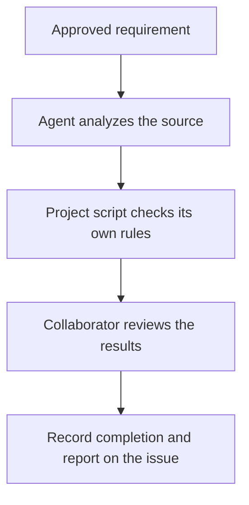

# Build a pipeline from steps

[Documentation](README.md) / Project steps

NexKit supplies skills and reusable jobs. Your project chooses which jobs run,
their order and their settings. A project-specific step stays in your own
repository: it can use an agent, run a command or call an existing GitHub Action.

The standalone task and project-step capabilities on this page are included in
**NexKit 1.0.0**.
Pin the reviewed commit for the version you install.
The project format remains `schema: 1`; existing release tags are immutable.

## Skills, steps and pipelines

| Part | What it does |
|---|---|
| Skill | Gives an agent instructions for a particular kind of work |
| Agent invocation | Runs a configured task with its model, skills and budget |
| Project step | Runs your command or records the result of your native GitHub job |
| Approval | Saves selected results, waits for a decision and resumes the accepted workflow |
| Pipeline | Connects these jobs through GitHub Actions YAML |

A reusable job can contain several internal jobs to keep model access,
project code and publication permissions separate. You choose the business
steps; NexKit supplies the execution boundaries.



This example produces a report without a PR. Code delivery can also include a
project step, such as checking migrations after publishing a candidate and before
the independent review. Automatic merge still requires the existing test, E2E,
review and branch-rule conditions.

## Choose the work type

- **`delivery` entrypoint:** source changes, a candidate PR, required checks,
  independent review and merge.
- **`tasks` entrypoint:** read-only agent tasks and project steps, ending with a
  report. No editor, reviewer model, PR or merge settings are required.

Pipeline identifiers are your choice. A pipeline uses one of these entrypoints;
create separate pipelines when the project needs both work types. `intake` and
optional `clarify` can be wired to either. Starting an issue does not approve it:
the requirement approval remains necessary before work begins.

The tasks entrypoint calls `prepare-work.yml` with `work_type: tasks`, then uses
agent/project jobs and `finish-tasks.yml`. The finalizer must run with `always()`
after every managed job. Its `jobs_succeeded` input comes from the actual native
job results, including each managed result's `status == 'done'`.

Task pipelines use the same `limits.attempts`, `limits.minutes` and
`limits.command_seconds`. Add `limits.agent_calls` and engine settings when they
run agents. Agent calls are charged before execution; project steps make no
model reservation. Retries keep the recorded counters. A task pipeline with
only commands or native jobs needs no model or model credential.

The [standalone example](examples/standalone-tasks.yml) connects the original
run and its [approval continuation](examples/task-continuation.yml).

## Add an agent step

Use a named `invocations` entry with `contract: task`. Give it an accepted prompt,
optional text skills, model, reasoning effort and time limit. Task invocations
read the source and return findings in their report; they cannot publish source.

This is a pipeline fragment, not a complete project configuration:

```json
{
  "entrypoints": {
    "intake": ".github/workflows/intake.yml",
    "tasks": ".github/workflows/inspect.yml"
  },
  "agent_workflows": [".github/workflows/inspect.yml"],
  "invocations": {
    "inspect": {
      "contract": "task",
      "model": "gpt-6-luna",
      "reasoning_effort": "max",
      "minutes": 10,
      "task": ".nexkit/controls/inspect.md"
    }
  }
}
```

The model and time are examples. A task invocation defaults to `required: true`
in a tasks pipeline. Set `required: false` when native conditions may omit it.
In delivery, invocations keep their existing optional scheduling default unless
`required: true` is declared; the editor and independent review are still mandatory
for merge. Any invocation that starts must finish successfully before completion.

Use `agent-invocation.yml` with its invocation identifier. Pass preceding recorded
agent or project reports through `input_artifact_ids`, using exact producer outputs.
See [agent calls](agent-invocations.md) for the other settings.

## Add a command step

Declare `steps` beside `invocations`, `entrypoints` and `approvals`:

```json
{
  "steps": {
    "project-rules": {
      "kind": "command",
      "subject": "stage",
      "argv": ["python3", "scripts/check_project_rules.py"],
      "timeout_seconds": 120,
      "retry": "safe",
      "required": true
    }
  }
}
```

Connect the identifier to `project-step.yml`. It reserves the step, checks the
current approval and source, runs the command in an isolated hosted job, and
records the result. Commands use the configured `environment.setup`. Setup and
execution share the step's timeout. They receive no model credential or GitHub
write token. Files changed by this job are not published as source changes.

| Field | Meaning |
|---|---|
| `kind` | `command` or `workflow` |
| `subject` | `stage` preserves the source used at this point; `candidate` requires the current published delivery candidate and becomes stale when it changes |
| `argv` | A nonempty argument array for a command step; no shell-string interpolation |
| `job_name` | Exact native job display name for a workflow step |
| `timeout_seconds` | Positive execution limit, at most `limits.command_seconds` and the pipeline's total time budget |
| `retry` | `safe` permits another bounded round; `never` prevents replay after reservation, including recovery through a new round |
| `required` | Defaults to `true`; a missing required result blocks completion even if the YAML omitted the job |

An optional step may be omitted. Once reserved, it must record a successful result
before work completes. For a delivery validation that must assess the final code,
use `subject: candidate` and place it after candidate publication. Project steps
are additional evidence; they do not replace native test reports or AI review.
Pass the step's report to the review invocation when the reviewer should assess
its findings, using the same exact `input_artifact_ids` connection.

### Read inputs and return a useful summary

The command workspace contains `.nexkit-step-input.json` with the issue, source,
feedback and the preceding reports selected in YAML. These reports are data,
not permission to take additional actions.

Exit code zero marks a plain command as done. A nonzero exit or timeout blocks
it. To add a readable summary or structured findings, write
`.nexkit-step-result.json` in the workspace:

```json
{
  "status": "done",
  "summary": "All public endpoints have documented request and response schemas.",
  "data": {
    "endpoints_checked": 12
  }
}
```

`status` is `done` or `blocked`; `summary` is required; `data` is optional JSON.
The result is limited to 48 KB and its summary to 8,000 characters. A successful
process may report `blocked` when its business rule did not pass. A failed process
cannot report `done`. The reserved input and result files must not already exist
in source; setup commands cannot supply the final result.

On Actions, NexKit prepares the input, runs commands and reads the result as the
isolated command account. The controller keeps its own credentials and report
files outside that workspace. Commands can use a private result file; they do
not need to make the workspace writable by the runner or other users.

NexKit records the result and command evidence in an exact report artifact. That
artifact can feed a later agent or an approval. The project owns the meaning and
implementation of its rule; NexKit verifies execution, identity and completion.

## Connect an existing action or workflow

Use `kind: workflow` for a native job your project owns:

```json
{
  "steps": {
    "package-audit": {
      "kind": "workflow",
      "subject": "stage",
      "job_name": "Project package audit",
      "timeout_seconds": 300,
      "retry": "safe"
    }
  }
}
```

Wire three jobs:

1. `prepare-step.yml` reserves `package-audit` and returns its context and source.
2. Your native job depends on that reservation, uses its source and runs the
   selected action, script or reusable workflow. Call `guard-step` immediately
   before project work to recheck the requirement, cancellation and reservation.
3. `record-step.yml` depends on the native job and verifies its result with GitHub.

The recorder reads the job from the exact Actions run attempt, requires a unique
matching name, checks that it started after reservation and observes its actual
conclusion and elapsed time. Set `timeout-minutes` on the native job too: the
recorder observes time after execution and cannot cancel another job at its limit.

A native job may upload one result JSON using the same small format above and
pass its exact artifact ID to the recorder. Without that file, NexKit reports the
native job name and conclusion. An unsuccessful or skipped job cannot become a
successful NexKit result through a custom JSON file.

See the [native project-step example](examples/native-project-step.yml).
Its Python commands and temporary paths work on either hosted OS; select
`windows-2025` for the project-owned job when needed. Keep the managed runner
configuration on Linux and bind the job's exact display name in the step.
For a reusable workflow, bind the actual job display name returned by GitHub,
including any caller prefix. Give each required matrix shard its own step and
literal name. Wildcards, “latest run” lookups and name collisions are rejected.

Your workflow still owns permissions, checkout, secrets and the custom action's
behavior. Inspect these during setup and pin external actions/workflows. A native
job must depend on the successful reservation before starting; NexKit does not
schedule or sandbox arbitrary jobs added to your YAML.
Managed `command` steps use Linux. To check Windows application behavior, put
the actual checks in a `windows-2025` job and record it as a `workflow` step,
using its reserved source, exact job display name and result. Keep that job free
of model credentials. A Linux container on a Windows host does not replace it.
Custom native jobs make no NexKit model reservation. Use configured agent
invocations for model work that must count toward NexKit's usage limits.

Use `retry: never` for a step whose repetition could repeat an external effect,
unless its implementation makes repetition safe. An interrupted reservation with
this policy cannot start a fresh round automatically or through `/nexkit resume`.
Investigate the effect before submitting new approved work. NexKit does not
promise exactly-once execution or implement cloud-specific deployment recovery.

The job observation uses GitHub's documented
[jobs for a workflow run attempt](https://docs.github.com/en/rest/actions/workflow-jobs#list-jobs-for-a-workflow-run-attempt)
endpoint. Recording these jobs requires `actions: read`.

## Add approval and finish

Project reports use the same `input_artifact_ids` connection as agent reports.
They can be saved in an approval checkpoint and supplied to the continuation
after the original workflow ends.

In an approval definition, `protects` may contain `step:<identifier>` to guard
that step's reservation. Standalone tasks use issue-mode stage decisions.
Use `protects: ["complete"]` for a final report approval: request it only after
all work is complete, and pass every recorded report into the checkpoint.
All enabled gates must be approved before the finalizer can complete work.

The standalone example uses this `approvals` fragment. Choose the review window
and quorum during setup; these values are illustrative:

```json
{
  "report-review": {
    "enabled": true,
    "mode": "issue",
    "subject": "stage",
    "reviewers": "repository",
    "minimum": 1,
    "wait_minutes": 1440,
    "on_rejection": "retry",
    "continuation": ".github/workflows/continue-inspection.yml",
    "protects": ["complete"]
  }
}
```

Install the continuation example at that path and the original example at the
configured tasks entrypoint. Include both workflow hashes, the prompt and any
control script hashes in `files`. Supply the project identity, immutable kit pin,
accepted decisions, knowledge paths, environment and execution limits through
the [normal project configuration](configuration.md).

The continuation uses `resume-approval.yml`. It runs only the remaining jobs,
without reserving another round or replaying completed work. Keep the original
and continuation workflows in the same concurrency group. A continuation that
calls agents must appear in `agent_workflows`; a finish-only continuation does not.

`finish-tasks.yml` verifies required results and decisions, records `completed`
and posts a short summary with the Actions link. The issue stays open for
follow-up; task completion does not imply a merge, release or source change.
Delivery and release retain their [issue completion policy](issue-completion.md).

## Set up or change the pipeline

With `nexkit-init`, describe the desired work, any project-specific rules and
where approval is needed. The skill prepares prompts, scripts, configuration and
native workflows for review. Only agent jobs need models and model access.

For manual setup, prepare those same files and use the existing
[installation preview and apply flow](manual-setup.md). Put trusted prompts and
control scripts in `.nexkit/controls/`, or explicitly accept consumer-owned paths
with `managed: false`. Hash workflows and local actions/scripts that determine
control or interpretation. Keep ordinary application code in the source checkout.

Configuration changes are deliberate setup updates; they invalidate old work
evidence. `doctor` shows resolved steps, invocations and approvals. It does not
prove a custom workflow's dependencies or external integration work correctly.

See the [verification guide](acceptance.md) for automated checks and required live
execution evidence. Each new native graph needs its own execution evidence before being
described as ready.
