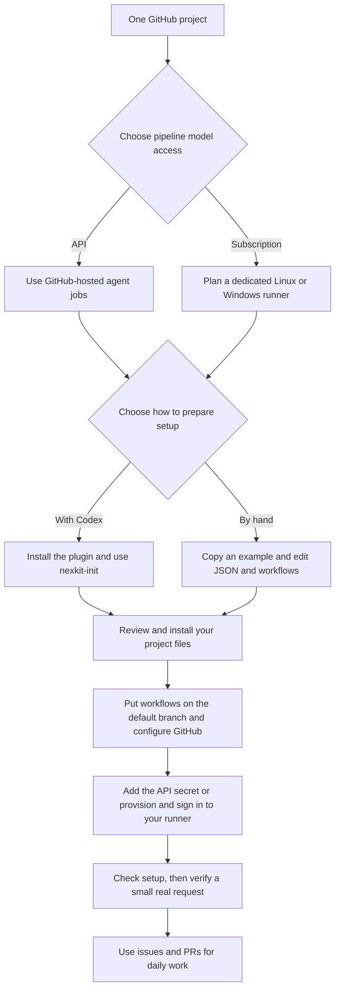

# Set up NexKit from scratch

[Documentation](README.md) / Setup roadmap

This roadmap describes this release's GitHub and Codex integration. Check
[current support](support.md) when selecting the kit version for your project.

You need one GitHub repository and a way for its pipeline to access a model.
A VPS is needed only if you choose it as the machine for your own runner.
You can set up NexKit with Codex or by editing files and running
commands yourself.

## 1. Choose how the pipeline will run

| | GitHub-hosted agents with API access | Your own runner with subscription access |
|---|---|---|
| Machine for agent jobs | GitHub provides the runner | You provide a supported Linux or Windows machine |
| Model login | An OpenAI API key in your repository's Actions secrets | Codex ChatGPT login in the project's runner |
| VPS required? | No | A VPS is one option; a compatible machine you already own can fill this role |
| Ongoing responsibility | Maintain the configuration, API access and available usage | Also keep the runner online, maintained and signed in |
| Setup instructions | [Guided setup](getting-started.md) or [manual setup](manual-setup.md) | Either setup path, then [runner administration](self-hosted.md) |

API usage has separate billing from a ChatGPT subscription. Subscription mode
uses the signed-in account's Codex allowance. See
[OpenAI authentication](https://learn.chatgpt.com/docs/auth).

Subscription jobs use one Linux container runtime: Docker Engine on Ubuntu
24.04 x64, with systemd. Windows hosts run that Ubuntu environment in WSL 2;
Docker Desktop is optional. See [Windows host setup](windows-runner.md) for
prerequisites and the process that keeps its runner online.
The [runner guide](self-hosted.md) explains both choices and their prerequisites. Installing
an ordinary GitHub runner on an arbitrary computer is not the complete NexKit
subscription setup. Its use with public repositories is experimental; read
the [support boundary](self-hosted.md#support-boundary) before choosing it.

**You can choose settings and prepare files before getting a VPS.** The runner
and login must be ready before the pipeline can invoke a model. Each project
uses infrastructure and account access supplied by its own operator.

## 2. Understand the three places involved

| Place | What happens there | Must it stay online? |
|---|---|---|
| Your setup computer | Clone the project, prepare configuration and install files; optionally talk to Codex | Only while doing local setup or maintenance |
| GitHub | Store the project, receive issue comments, schedule Actions jobs, show PRs and enforce branch rules | GitHub hosts this service |
| Agent runner | Run the model jobs selected by the workflow | Your dedicated runner must be online when those jobs need it; GitHub manages hosted runners |

Your setup computer and your runner host can be the same VPS. They can also be
different machines. In subscription mode, controller and application-check jobs
still run on GitHub-hosted runners; the dedicated runner handles the model jobs.

There are also separate sign-ins:

- **GitHub CLI login:** lets the setup operator inspect or manage the repository.
- **Interactive Codex login:** used only if you choose guided setup.
- **Pipeline model access:** an API secret or the dedicated runner's Codex login.

Installing the plugin does not transfer the local Codex login to GitHub or
register a runner. Start subscription login in the runner's environment. You
can complete its device-code page in a browser on your personal computer.

## 3. Prepare only what your chosen path needs

For both setup paths:

- One GitHub repository with a default branch, and a local checkout. A README
  is enough to begin planning a new application.
- Python 3.11+, Git and an authenticated GitHub CLI on the setup computer.
- The NexKit toolkit checkout, with `bin/nexkit` on your `PATH`.
- Repository administrator access, or an administrator who can apply the
  proposed Actions and branch settings.
- Your project's real test commands, or an explicit plan to add them if the
  application does not exist yet.

Add Codex CLI and the NexKit plugin for **guided setup**.
For **manual setup**, use a text editor and the CLI; opening Codex is
optional. GitHub's pipeline still uses coding agents after requests are started.

Add the model access chosen in step 1 before attempting a live request in your
application repository.

## 4. Follow one setup path

### With Codex

Follow [Install and set up with Codex](getting-started.md). Install the
plugin, open your application repository in Codex, then select `nexkit-init`.
Describe the work you want to automate and the access choice you made above.
Codex reads your project and prepares a proposal for you to review.

### Without an assistant

Follow [Set up manually](manual-setup.md). Copy the complete example, edit the
project settings and workflow files, then preview and apply them with the CLI.
The guide includes branch settings and separate API and subscription steps.

`nexkit-init` is a Codex skill. There is currently no interactive
`nexkit init` terminal wizard. The terminal command `nexkit setup` takes files
that you or an assistant have prepared.

Both paths produce the same kinds of project files and use the same runtime.
You can start manually and use the setup skill for later changes, or the reverse.

## 5. Know when each step is finished

| Step | What you should have before moving on |
|---|---|
| Choose the design | Pipeline names, jobs, real check commands, model access, limits and approval choices |
| Prepare the proposal | A complete project JSON and the workflow/control files it accepts |
| Preview and install | Reviewed changes installed in the project, with an installation record |
| Publish setup files | The configuration and workflows on the repository's default branch |
| Configure GitHub | Actions can create PRs; branch rules match the selected review and check policy |
| Configure model access | The API secret exists, or the selected runner is registered, isolated and signed in |
| Inspect readiness | `nexkit doctor --online --checks` reports the installed configuration, application checks and GitHub settings |
| Verify actual operation | A small, explicitly budgeted request produces a specification and, after your approval, a checked and reviewed code change |

The installer changes local files. It does not create a GitHub repository,
provision a VPS, change GitHub settings or sign in to an account. Guided setup
can help with those steps using separate tools and the permissions you provide.

`doctor` does not invoke a model and does not prove that a live model call will
succeed. A successful runner registration or login also does not establish
complete delivery. Keep configuration checks, runner probes and actual model
runs separate when recording setup results.

An empty application will not have passing behavior checks yet. It can be
configured for an initial request, but setup must report that missing evidence.

## 6. Hand the project over to its users

Add a short section to **your project's README** with:

- The available pipeline names and what each does.
- How to start work, such as `/nexkit start maintenance` on an issue.
- Where the bot asks for requirement approval and any later PR approvals.
- Where to find the Actions runs and whom to contact for runner or login repair.
- A link to the project's accepted settings and any team-specific conventions.

Collaborators then follow [daily use](daily-use.md). They can create issues,
discuss requirements, copy the bot's exact approval command and review PRs
through GitHub. They do not need to install the plugin or have access to the VPS
for those tasks. Commands and approvals require the repository permissions
described in the daily-use guide.

The setup conversation can close after setup. The configured GitHub workflows
receive later events and continue work. The account owner or administrator
returns when a login, runner, configuration or usage limit needs attention.

Next: [guided setup](getting-started.md), [manual setup](manual-setup.md), or
[common setup questions](setup-faq.md).
