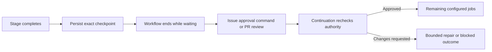

# Optional stage approvals

Requirement and release approvals remain the default decisions. During
setup, a consumer may add approval steps at selected boundaries in its composed
delivery workflow. Native YAML owns the job order and the jobs that run after a
decision. NexKit checks authorization and preserves the exact result being reviewed.

These capabilities currently apply to schema-2 delivery with individually
configured invocations. Existing schema-1 consumers retain their accepted behavior
until an explicit setup migration. Enabling an extra gate does not replace the
requirement approval, independent AI reviewer, required checks or release decision.



## Configure a gate

Add `approvals` beside a pipeline's `invocations`. Identifiers are chosen by the
consumer. This example adds a PR review before merge:

```json
{
  "pr-review": {
    "enabled": true,
    "mode": "pull_request",
    "subject": "candidate",
    "reviewers": "repository",
    "minimum": 1,
    "wait_minutes": 2880,
    "on_rejection": "retry",
    "continuation": ".github/workflows/continue.yml",
    "protects": ["merge"]
  }
}
```

| Field | Meaning |
|---|---|
| `enabled` | Explicit boolean. A disabled gate forwards its context without waiting. |
| `mode` | `issue` uses exact commands on the requirement issue; `pull_request` uses native GitHub reviews. |
| `subject` | `stage` freezes the supplied stage results and source; `candidate` also requires the current PR head/base. PR mode requires `candidate`. |
| `reviewers` | `"repository"` accepts any collaborator with current write, maintain or admin access. An explicit list such as `["alice", "bob"]` restricts approvals to those logins, who must also retain that access. Bot reviews do not count. |
| `minimum` | Positive number of distinct eligible reviewers required. For a login list, it cannot exceed that list's size. Native PR rules must use the same count. |
| `wait_minutes` | Configurable continuation window, from 1 to 43,200 minutes, separate from execution time. The example's 2,880 minutes means 48 hours; it is not a fixed default. |
| `on_rejection` | `retry` passes feedback into a bounded delivery round; `block` stops until deliberate recovery. |
| `continuation` | Exact default-branch workflow included in the accepted control-file manifest. |
| `protects` | Capabilities requiring this decision: `invocation:<id>`, `check:<name>`, `publish` or `merge`. |

All enabled gates must have valid decisions before merge, even if YAML accidentally
skips them. A protected capability also checks its own prerequisite before it can
run. An early stage decision remains attached to that original stage result after
an authorized edit. A candidate decision becomes stale when its candidate changes.

Use `reviewers: "repository"` for ordinary team review. Membership is checked again
when a decision is consumed and before merge, so new collaborators can review and
removed permissions invalidate an earlier approval. A repeated approval from the
same person counts once. Existing login-list configurations keep their original
meaning until setup explicitly changes them. The setting applies to issue-mode
approvals as well as PR reviews.

For example, a planning decision can use `mode: issue`, `subject: stage` and
`protects: ["invocation:change-source"]`. Place the request after a completed
read-only planning invocation, then place the editor in its continuation workflow.
The configured names are examples, not built-in stage types.

Publish completed source edits before requesting code approval. Waiting with an
unpublished editor workspace is rejected: publication must preserve that editor's
original receipt and execution deadline. A candidate gate cannot protect its own
first publication or all source editors. A PR gate follows complete current checks
and at least one independent AI review, so it cannot protect those prerequisites.
Setup rejects these provably impossible configurations.

## Wire native workflows

Three reusable capabilities provide the event boundary:

| Workflow | Inputs and behavior |
|---|---|
| `request-approval.yml` | `context_artifact_id`, `gate`, optional exact `input_artifact_ids`, `check_artifact_ids`, `review_artifact_id`. Saves a checkpoint and returns `ready: false`, `status: waiting_for_approval`. |
| `resume-approval.yml` | `pipeline`, `gate`; issue comes from the issue event or native dispatch input. Re-reads authority and returns a fresh `context_artifact_id` only when `ready: true`. |
| `review-events.yml` | Metadata-only relay for native `pull_request_review` events. Dispatches the configured continuation on the default branch; it runs no candidate code or model. |

All take `kit_repository` and an immutable `kit_ref`. Context/report inputs come
from required producer outputs, using the existing exact-artifact download guard.
The request job must follow every job whose result should be reviewed, and all
started agent invocations must be complete. Use a native barrier before waiting;
no unrelated execution should continue under the same logical delivery round.

See the complete [delivery wiring example](examples/reviewed-delivery.yml),
[continuation caller](examples/approval-continuation.yml) and
[PR review relay](examples/approval-review-events.yml). Replace their zero pins,
identifiers and repository paths with the consumer's accepted decisions. These
are connection examples, not project presets. Hash the actual caller files into
`files`. List a continuation in `agent_workflows` if it invokes a credential-bearing
agent; a finish-only continuation and the event relay do not need a VPS runner.

Use the same native `nexkit-work` concurrency group for the originating delivery
and continuation workflows. End the originating run after `waiting_for_approval`;
its finalizer recognizes that state and does not dispatch repair for skipped jobs.
The queue and runner are then available while reviewers consider the result.
The PR relay does not join that queue; its dispatched continuation does.

A continuation contains only the remaining jobs. It does not call `prepare-work`
again or replay earlier invocations. Pass its resumed context to individual
capabilities. Recorded input/check reports frozen in the checkpoint can be used
when those optional inputs are omitted. Original run identities and report hashes
are preserved. New-source checks must still match the new candidate.

For a finish-only continuation, call `finish-work.yml` with the resumed context,
`checkpoint_evidence: true`, `jobs_succeeded: true`, and no additional artifact
inputs. The controller retrieves and revalidates the frozen checks and review.
For a continuation that runs more jobs, pass their actual results and current
artifact IDs; do not treat resume success as success of those later jobs.

On `retry`, the declared delivery entrypoint receives the reviewer feedback through
its normal context. `prepare-work.outputs.repair` identifies a repair round, so
consumer YAML can select its intended repair path. NexKit does not interpret a
stage graph or jump to job names. Attempts and model-call reservations still count.

## Reviewing and approving

Issue-mode notices include the reviewed source, checkpoint hash, stage summaries
and links to the originating run and persisted evidence. Approve with the exact
command supplied by the bot:

```text
/nexkit approve-stage <gate> <checkpoint-hash>
```

To request changes, post:

```text
/nexkit request-changes <gate> <checkpoint-hash>
Explain the requested changes here.
```

Each command is an unedited comment from an eligible reviewer. Free-form comments
are not decisions. The issue continuation should listen for created, edited and
deleted comments and issue edits/closure. One person's repeated comments do not
satisfy a multi-person quorum.

For PR mode, review the actual PR diff, AI review and command results, then use
GitHub **Approve** or **Request changes**. Inline review comments are included in
repair feedback. Approvals must reference the exact head and be submitted after
the checkpoint was opened. A later comment-only review does not erase a blocking
review. Dismissal invalidates the corresponding decision. A blocking review from
another authorized collaborator remains a native blocker; that person does not
gain permission to trigger NexKit repair merely by being outside the configured list.

## Repository rules and setup

PR-mode gates require native rules on the target branch with the accepted review
count and stale-review dismissal, in addition to current NexKit verification and
AI-review checks. No bypass is granted. Configured reviewer/quorum validation is also
performed by NexKit; GitHub's numeric review-count rule does not itself enforce
an optional login list. Unintegrated code-owner, last-push, required-thread and
additional required-reviewer rules are rejected during setup rather than silently
removed. Inspect classic protection and inherited rules as well.

Branch rules affect every delivery pipeline targeting that branch. Such pipelines
must accept the same native required-review count; setup rejects a mix that would
silently add an approval gate to an ungated pipeline. Issue-mode stage decisions can
vary by pipeline without changing the native PR review count.

Policy and workflow edits are administrative setup changes. Preview the config,
workflow bundle, rules and runner allowlist, then verify the accepted update. Never
insert a new policy into already running consumer work without a deliberate migration.

## Durability, timing and limits

The existing `nexkit/state` branch stores a bounded checkpoint of context and
selected data, using Contents-API compare-and-swap. A checkpoint is accepted only
when the full state is at most 750,000 UTF-8 bytes. Source bundles remain in their
publication flow; they are not stored to hold an uncommitted editor open.
All state writes are capped at 900,000 bytes to stay within the Contents reader's
size contract. GitHub documents its [Contents response limits](https://docs.github.com/en/rest/repos/contents#get-repository-content).
Decision receipts retain reviewer identities and verdicts; reviewer
repair feedback is bounded to 24,000 UTF-8 bytes rather than copied per reviewer.
Checkpoint evidence survives the original seven-day Actions artifact retention.
A resumed run uploads a fresh context artifact. Full state and evidence are visible
to repository readers, so they must contain no secrets or sensitive runtime data.

Waiting makes no CLI reservation and retains no runner or native workflow run.
Only recorded approval-wait intervals are excluded from the delivery elapsed budget;
active execution, calls and rounds retain their original accounting. Expiry is
checked on the next event/resume, and `nexkit status` reports an expired pending
wait. No background timer is installed to update an idle issue at the exact expiry.

A repeated wake-up cannot claim an active continuation. A claim interrupted before
any downstream agent reservation can be recovered without another call or double
wait credit. After downstream agent work starts, use normal bounded recovery;
completed agent calls are not replayed as free work. Request-changes feedback and
repair-dispatch intent survive lost writes/responses. A lost dispatch response may
cause another queued dispatch; normal delivery guards and limits still apply.
Native reruns inspect the recorded attempt, since a rerun keeps the Actions run ID.
The controller uses GitHub's [run-attempt endpoint](https://docs.github.com/en/rest/actions/workflow-runs#get-a-workflow-run-attempt).
The delivery entrypoint cannot reserve a new round over an unused continuation
claim or pending repair dispatch. `nexkit resume` routes that recovery to the
accepted continuation. A blocked rejection preserves feedback for later recovery.

Cancellation, expired waits, changed authority and stale configuration/source block
continuation. Revoked approval is not a reason to call an agent. A stopped decision
requires a fresh `/nexkit resume` after its cause is resolved. `nexkit resume` can
also wake a pending continuation after a missed event; it never supplies approval.

Authority is re-read before consequential operations, and PR rules enforce their
own conditions during merge. GitHub does not provide one atomic transaction joining
issue comments, configured reviewer identities, arbitrary stage decisions and merge.
A concurrent change in the final read-to-write interval remains an external race;
the native review count is not an atomic guarantee for an exact login allowlist.

The current verification includes local functional tests, mocked GitHub failure
injections, workflow lint and independent review. No live stage-approval cycle or
consumer migration is claimed by these checks. The PR-review and event semantics
come from GitHub's [review rules](https://docs.github.com/en/repositories/configuring-branches-and-merges-in-your-repository/managing-protected-branches/about-protected-branches)
and [workflow events](https://docs.github.com/en/actions/reference/workflows-and-actions/events-that-trigger-workflows#pull_request_review).
