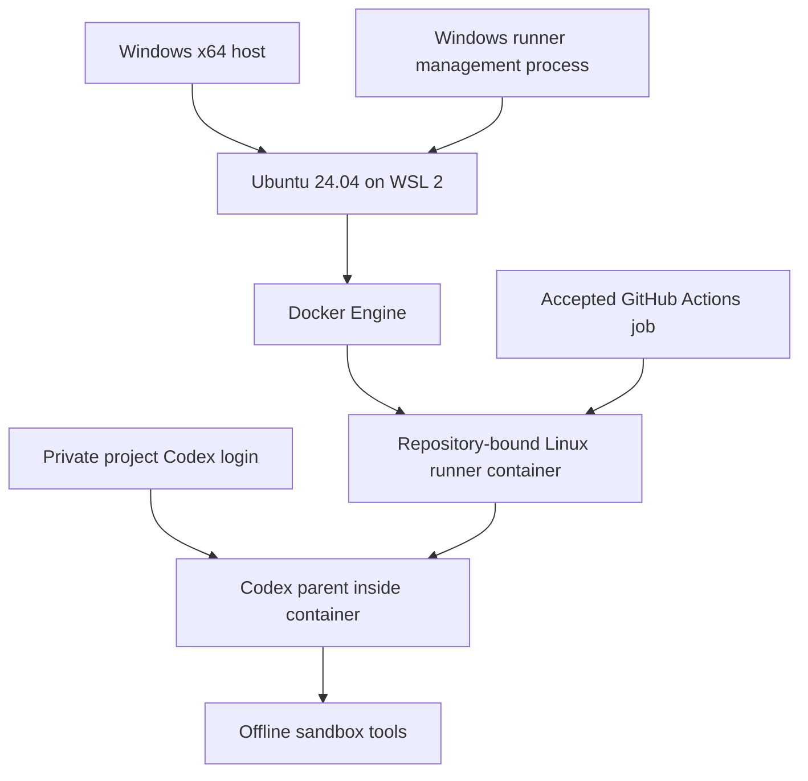

# Run NexKit on a Windows host

[Documentation](README.md) / [Runner administration](self-hosted.md) / Windows

A Windows host runs NexKit's subscription runner in a Linux container inside
**Ubuntu on WSL 2**. Install Docker Engine and its CLI in that Ubuntu
distribution. **Docker Desktop is not required.** Linux hosts use the same
container image, admission hook and Codex execution path.

The steps below use Ubuntu 24.04, the CI reference environment. A different
Ubuntu release must meet the same runtime prerequisites and pass its native
checks; it is not rejected solely because its version differs.

You provide the machine, repository permissions and Codex login. Installing the
plugin does not register a runner or transfer your interactive login. The
[public subscription support boundary](self-hosted.md#support-boundary) applies.
Read the [verification guide](acceptance.md) before provisioning your runner.



## 1. Choose the project settings

The runner registers as **Linux**, even though the physical host is Windows:

```json
{
  "engine": {"name": "codex", "auth": "chatgpt"},
  "environment": {
    "runner": "ubuntu-24.04",
    "agent_runner": ["self-hosted", "linux", "x64", "your-project-runner"],
    "setup": []
  }
}
```

Keep the other accepted settings and real Linux dependency/check commands.
Select your own pipeline and project label. Follow
[runner binding preparation](self-hosted.md#prepare-a-runner-binding) to accept
the exact workflows allowed to use this runner.

For Windows-specific tests, add an ordinary `windows-2025` job in the consumer's
workflow and record it with a [project workflow step](project-steps.md).
The Linux container does not verify Windows application behavior.

## 2. Prepare Windows and Ubuntu

Use an x64 Windows host capable of WSL 2, with virtualization enabled, Python
3.11+ and the reviewed NexKit checkout. Follow Microsoft's
[WSL installation instructions](https://learn.microsoft.com/en-us/windows/wsl/install).
Windows Server has [separate instructions](https://learn.microsoft.com/en-us/windows/wsl/install-on-server).

In an administrator PowerShell terminal:

```powershell
wsl --install --distribution Ubuntu-24.04
wsl --list --verbose
```

Complete Ubuntu's first launch and confirm the distribution uses version **2**.
Enable systemd in `/etc/wsl.conf`, preserving any existing settings:

```ini
[boot]
systemd=true
```

Restart that distribution with `wsl --terminate Ubuntu-24.04`. Install Docker
Engine using [Docker's Ubuntu instructions](https://docs.docker.com/engine/install/ubuntu/).
The Linux environment also needs Python 3, Git, `sudo`, iptables and GitHub CLI.
Install and authenticate GitHub CLI as the Linux operator used by NexKit:

```powershell
wsl --distribution Ubuntu-24.04 --user root --exec gh auth login
wsl --distribution Ubuntu-24.04 --user root --exec gh auth status
```

That account needs permission to register this repository's Actions runner.
Complete this login in WSL; NexKit does not copy a Windows GitHub credential.
Provisioning builds the image from the reviewed checkout inside WSL, selecting
the optional `engine.install.version` pin or the current npm release. Preview shows the image tag and exact
build arguments before `--apply` runs them.

Use Docker's default context with the local Ubuntu Engine. The preflight checks
its systemd process, network namespace and socket; Docker Desktop socket proxies
and remote/container engines do not satisfy this setup. NexKit also checks the
actual Linux kernel and seccomp support. It uses the supplied AppArmor namespace profile
when the kernel provides AppArmor; the container and Codex sandbox probes must
pass on each host regardless of that optional kernel facility.

## 3. Preview, check and provision

From the reviewed NexKit checkout in Windows PowerShell:

```powershell
python scripts/provision_runner.py --config C:\projects\your-project\.nexkit\project.json --pipeline maintenance --wsl-distribution Ubuntu-24.04
python scripts/provision_runner.py --config C:\projects\your-project\.nexkit\project.json --pipeline maintenance --wsl-distribution Ubuntu-24.04 --check-host
python scripts/provision_runner.py --config C:\projects\your-project\.nexkit\project.json --pipeline maintenance --wsl-distribution Ubuntu-24.04 --apply
```

Replace the paths and pipeline name. Add `--invocation NAME` when provisioning
an invocation's runner override. Preview changes nothing. `--check-host` inspects
prerequisites without registration or login. Apply registers the Linux runner,
installs its repository binding and scoped network policy, and leaves it stopped.

Registration uses a short-lived GitHub token inside WSL. The administrator's
login stays there. No Windows drive, Docker socket or other project login is
mounted into the runner. Its private state is under `/var/lib/nexkit-runners/`.

## 4. Verify the runtime before adding a login

Run the physical container checks from Windows:

```powershell
python scripts/verify_docker_host.py --wsl-distribution Ubuntu-24.04
```

This administrative test requires Docker access and Python 3 in Ubuntu. It builds a
test image and uses temporary containers, a scoped bridge and harmless canaries.
It checks real Codex tools, command isolation, review permissions and denied
host access. Model responses are simulated; it does not register a runner,
log in or make real model calls.

Next, start the registered runner using the command in step 6 and perform the
[GitHub admission probes](self-hosted.md#verify-before-adding-a-login).
Stop that management process before signing in. Local probes do not replace
actual GitHub admission or a small live delivery with authorized usage.

## 5. Complete the official Codex login

With this runner stopped, run in Windows PowerShell:

```powershell
python scripts/manage_runner.py login --config C:\projects\your-project\.nexkit\project.json --pipeline maintenance --wsl-distribution Ubuntu-24.04
```

The account owner completes Codex's device-code page. The browser can be on a
different computer; the CLI and login directory stay in this consumer's Linux
environment. Sign in separately for each consumer. Codex owns login and refresh;
NexKit does not parse tokens or upload account files.

## 6. Keep the runner online

Run in Windows PowerShell and keep the process running:

```powershell
python scripts/manage_runner.py run --config C:\projects\your-project\.nexkit\project.json --pipeline maintenance --wsl-distribution Ubuntu-24.04
```

The Windows process holds WSL open and sends the current Windows host addresses
to the Linux supervisor. It stops the consumer service when the connection ends
or its heartbeat stops. Address changes stop the runner before updating the
host protection rules and restarting it. Closing this process stops the runner.
From another terminal, replace `run` with `status` or `stop` to inspect or stop it.

WSL's systemd services alone
[do not keep a distribution alive](https://learn.microsoft.com/en-us/windows/wsl/systemd).
This version provides a supervised process, not a native Windows service.
A scheduled task at Windows sign-in can launch the same command. Starting
without any Windows sign-in after reboot needs separate deployment and
verification; it is not established by a terminal run.

For updates and retirement, follow [shared maintenance](self-hosted.md#execution-and-maintenance).
Stop the management process first. Removing plugin files does not unregister
the runner or revoke its Codex login.
